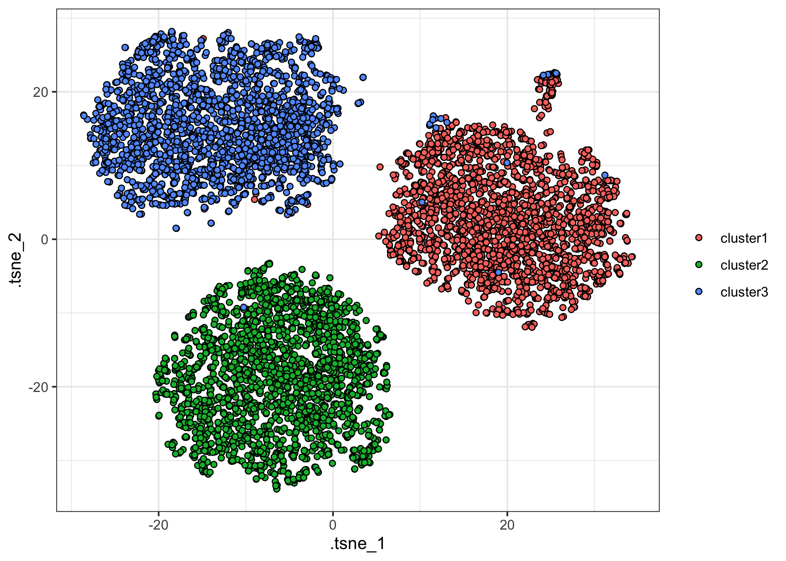
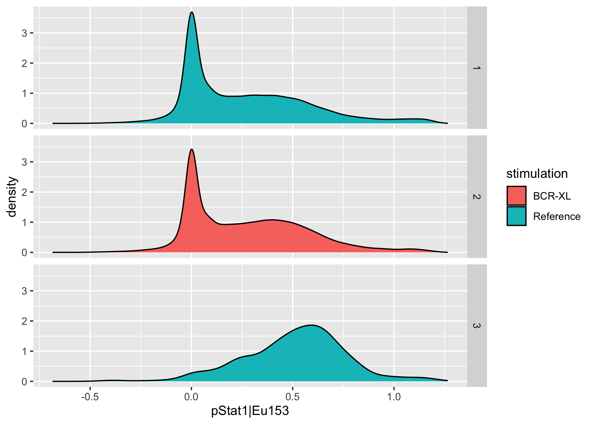

<!-- README.md is generated from README.Rmd. Please edit that file -->

# tidytof: An ecosystem for tidy and highly-reproducible CyTOF data analysis

<!-- badges: start -->

[](https://github.com/keyes-timothy/tidytof/actions)
[](https://app.codecov.io/gh/keyes-timothy/tidytof?branch=main)

<!-- badges: end -->

The goal of `tidytof` is to provide an integrated suite of R functions
for CyTOF data analysis using an intuitive and internally consistent set
of design principles. As an extension of the `tidyverse` ecosystem of
data manipulation tools in R, `tidytof` is both performant and
easy-to-use for scientists with a wide range of coding experience
(including beginners).

## Installation

You can install the development version of tidytof from GitHub with the
following command:

``` r
if(!require(devtools)) install.packages("devtools") 
devtools::install_github("keyes-timothy/tidytof")
```

Once `{tidytof}` is installed, we can load the packages we need for this
vignette:

``` r
library(tidytof)
#> Registered S3 methods overwritten by 'parameters':
#>   method                           from      
#>   as.double.parameters_kurtosis    datawizard
#>   as.double.parameters_skewness    datawizard
#>   as.double.parameters_smoothness  datawizard
#>   as.numeric.parameters_kurtosis   datawizard
#>   as.numeric.parameters_skewness   datawizard
#>   as.numeric.parameters_smoothness datawizard
#>   print.parameters_distribution    datawizard
#>   print.parameters_kurtosis        datawizard
#>   print.parameters_skewness        datawizard
#>   summary.parameters_kurtosis      datawizard
#>   summary.parameters_skewness      datawizard
#> Registered S3 method overwritten by 'tune':
#>   method                   from   
#>   required_pkgs.model_spec parsnip
library(tidyverse)
#> ── Attaching packages ─────────────────────────────────────── tidyverse 1.3.1 ──
#> ✓ ggplot2 3.3.5     ✓ purrr   0.3.4
#> ✓ tibble  3.1.5     ✓ dplyr   1.0.7
#> ✓ tidyr   1.1.4     ✓ stringr 1.4.0
#> ✓ readr   2.0.2     ✓ forcats 0.5.1
#> ── Conflicts ────────────────────────────────────────── tidyverse_conflicts() ──
#> x dplyr::filter() masks stats::filter()
#> x dplyr::lag()    masks stats::lag()
```

## Usage

### Reading data (including example datasets)

`{tidytof}` comes bundled with several example mass cytometry datasets.
To access the raw .fcs and .csv files containing these data, use the
`tidytof_example_data` function. When called with no arguments,
`tidytof_example_data` will return a character vector naming the
datasets contained in {tidytof}:

``` r
tidytof_example_data()
#> [1] "aml"                  "ddpr"                 "mix"                 
#> [4] "mix2"                 "phenograph"           "phenograph_csv"      
#> [7] "scaffold"             "statistical_scaffold" "surgery"
```

To obtain the file path for the directory containing each dataset, call
`tidytof_example_data` with one of these dataset names as its argument.
For example, to obtain the directory for the phenograph data, we would
use the following command:

``` r
tidytof_example_data("phenograph")
#> [1] "/Library/Frameworks/R.framework/Versions/4.0/Resources/library/tidytof/extdata/phenograph"
```

Using one of these directories (or any other directory containing CyTOF
data on your local machine), we can use `tof_read_data` to read in CyTOF
data from raw files. `tof_read_data` is smart enough to read single
.fcs/.csv files or multiple .fcs/.csv files depending on whether its
first argument (`path`) leads to a single file or to a directory of
files.

``` r
phenograph <- 
  tidytof_example_data("phenograph") %>% 
  tof_read_data()

phenograph
#> # A tibble: 77,563 × 45
#>    file_name  `Time|Time` `Cell_length|Ce… `DNA1|Ir191` `DNA2|Ir193` `BC1|Pd104`
#>    <chr>            <dbl>            <dbl>        <dbl>        <dbl>       <dbl>
#>  1 H1_PhenoG…         462               24         338.         663.        47.4
#>  2 H1_PhenoG…        5856               29         277.         577.       214. 
#>  3 H1_PhenoG…        7621               25         289.         679.       223. 
#>  4 H1_PhenoG…        8783               24         215.         393.        62.8
#>  5 H1_PhenoG…       10106               29         135.         342.        25.6
#>  6 H1_PhenoG…       11326               22         181.         393.        34.5
#>  7 H1_PhenoG…       12226               31         191.         491.        19.7
#>  8 H1_PhenoG…       12278               23         283.         570.        59.7
#>  9 H1_PhenoG…       13070               25         164.         468.        56.6
#> 10 H1_PhenoG…       13851               31         396.         532.       132. 
#> # … with 77,553 more rows, and 39 more variables: BC2|Pd106 <dbl>,
#> #   BC3|Pd108 <dbl>, BC4|In113 <dbl>, BC5|In115 <dbl>, BC6|La139 <dbl>,
#> #   pPLCg2|Pr141 <dbl>, CD19|Nd142 <dbl>, p4EBP1|Nd143 <dbl>,
#> #   CD11b|Nd144 <dbl>, pAMPK|Nd145 <dbl>, pSTAT3|Nd146 <dbl>, CD34|Nd148 <dbl>,
#> #   pSTAT5|Nd150 <dbl>, pS6|Sm147 <dbl>, pCREB|Sm149 <dbl>, pc-Cbl|Sm152 <dbl>,
#> #   CD45|Sm154 <dbl>, CD123|Eu151 <dbl>, pSTAT1|Eu153 <dbl>,
#> #   pZap70-Syk|Gd156 <dbl>, CD33|Gd158 <dbl>, CD47|Gd160 <dbl>, …
```

Data are read into an extended `tibble` called a `tof_tbl`, an S3 class
identical to `tbl_df`’s, but with one additional attribute (“panel”).
`{tidytof}` stores this additional attribute in `tof_tbl`’s because, in
addition to analyzing CyTOF data from individual experiments, CyTOF
users often want to compare panels between experiments (to find common
markers or to compare which metals are associated with particular
markers across panels).

Note that the output `tof_tbl` contains one cell per row and one channel
per column (to provide the data in its “tidy” format). Also note that
`tof_read_data` adds an additional column to the output `tof_tbl`
encoding the name of the file from which each cell was read (the
“file\_name” column).

Because `tof_tbl`’s inherit from the `tbl` class, all methods available
to tibbles are also available to `tof_tbl`’s. For example, `{dplyr}`’s
useful `mutate` method can be applied to our `phenograph` `tof_tbl`
above to convert the columns encoding the phenograph cluster and
stimulation condition to which each cell belongs into character vectors
(instead of their original numeric codes in the uncleaned dataset).

``` r
phenograph <- 
  phenograph %>% 
  # mutate the input tof_tbl
  mutate(
    `PhenoGraph|PhenoGraph` = as.character(`PhenoGraph|PhenoGraph`), 
    `Condition|Condition` = as.character(`Condition|Condition`)
  )

phenograph %>% 
  # use dplyr's select method to show that the columns have been changed
  select(where(is.character))
#> # A tibble: 77,563 × 3
#>    file_name              `PhenoGraph|PhenoGraph` `Condition|Condition`
#>    <chr>                  <chr>                   <chr>                
#>  1 H1_PhenoGraph_cluster1 1                       1                    
#>  2 H1_PhenoGraph_cluster1 1                       1                    
#>  3 H1_PhenoGraph_cluster1 1                       1                    
#>  4 H1_PhenoGraph_cluster1 1                       1                    
#>  5 H1_PhenoGraph_cluster1 1                       1                    
#>  6 H1_PhenoGraph_cluster1 1                       1                    
#>  7 H1_PhenoGraph_cluster1 1                       1                    
#>  8 H1_PhenoGraph_cluster1 1                       1                    
#>  9 H1_PhenoGraph_cluster1 1                       1                    
#> 10 H1_PhenoGraph_cluster1 1                       1                    
#> # … with 77,553 more rows
```

The `tof_tbl` class is preserved even after these transformations.

``` r
phenograph %>% 
  class()
#> [1] "tof_tbl"    "tbl_df"     "tbl"        "data.frame"
```

Finally, to retrieve panel information from a `tof_tbl`, use
`tof_get_panel`:

``` r
phenograph %>% 
  tof_get_panel()
#> # A tibble: 44 × 2
#>    metals      antigens   
#>    <chr>       <chr>      
#>  1 Time        Time       
#>  2 Cell_length Cell_length
#>  3 Ir191       DNA1       
#>  4 Ir193       DNA2       
#>  5 Pd104       BC1        
#>  6 Pd106       BC2        
#>  7 Pd108       BC3        
#>  8 In113       BC4        
#>  9 In115       BC5        
#> 10 La139       BC6        
#> # … with 34 more rows
```

Importantly, `tof_read_data` uses an opinionated heuristic to mine
different keyword slots of input .fcs file(s) to guess which metals and
antigens were used during data collection. Thus, when .csv files are
being read using `tof_read_data`, it is recommended to use the
`panel_info` argument to provide the panel manually (as .csv files,
unlike .fcs files, do not provide built-in metadata about the columns
they contain).

### Pre-processing

Generally, the raw ion counts for each analyte measured on a mass
cytometer need to be transformed before CyTOF data analysis. Common
preprocessing steps may include variance-stabilizing transformations
(such as the hyperbolic arcsine (arcsinh) transformation or a log
transformation), scaling/centering, and/or denoising.

To perform standard preprocessing tasks with `{tidytof}`, use
`tof_preprocess`. `tof_preprocess`’s default behavior is to apply the
arcsinh transformation (with a cofactor of 5) to each numeric column in
the input `tof_tibble` as well as to remove the gaussian noise that
Fluidigm software adds to each ion count (this noise is added for
visualization purposes, but for most analyses, removing this noise is
recommended).

As an example, we can preprocess our `phenograph` `tof_tibble` above.

``` r
phenograph <- 
  phenograph %>% 
  tof_preprocess()

phenograph
#> # A tibble: 77,563 × 45
#>    file_name  `Time|Time` `Cell_length|Ce… `DNA1|Ir191` `DNA2|Ir193` `BC1|Pd104`
#>    <chr>            <dbl>            <dbl>        <dbl>        <dbl>       <dbl>
#>  1 H1_PhenoG…        5.22             2.31         4.91         5.58        2.96
#>  2 H1_PhenoG…        7.76             2.49         4.71         5.44        4.45
#>  3 H1_PhenoG…        8.02             2.35         4.75         5.61        4.49
#>  4 H1_PhenoG…        8.16             2.31         4.45         5.06        3.23
#>  5 H1_PhenoG…        8.30             2.49         4.00         4.92        2.35
#>  6 H1_PhenoG…        8.42             2.23         4.29         5.06        2.64
#>  7 H1_PhenoG…        8.50             2.56         4.34         5.28        2.09
#>  8 H1_PhenoG…        8.50             2.27         4.73         5.43        3.18
#>  9 H1_PhenoG…        8.56             2.35         4.18         5.23        3.13
#> 10 H1_PhenoG…        8.62             2.56         5.07         5.36        3.97
#> # … with 77,553 more rows, and 39 more variables: BC2|Pd106 <dbl>,
#> #   BC3|Pd108 <dbl>, BC4|In113 <dbl>, BC5|In115 <dbl>, BC6|La139 <dbl>,
#> #   pPLCg2|Pr141 <dbl>, CD19|Nd142 <dbl>, p4EBP1|Nd143 <dbl>,
#> #   CD11b|Nd144 <dbl>, pAMPK|Nd145 <dbl>, pSTAT3|Nd146 <dbl>, CD34|Nd148 <dbl>,
#> #   pSTAT5|Nd150 <dbl>, pS6|Sm147 <dbl>, pCREB|Sm149 <dbl>, pc-Cbl|Sm152 <dbl>,
#> #   CD45|Sm154 <dbl>, CD123|Eu151 <dbl>, pSTAT1|Eu153 <dbl>,
#> #   pZap70-Syk|Gd156 <dbl>, CD33|Gd158 <dbl>, CD47|Gd160 <dbl>, …
```

To alter `tof_preprocess`’s default behavior, change the `channel_cols`
argument (to specify which columns of `tof_tibble` should be
transformed) and the `transform_fun` argument (to specify which
vector-valued function should be used to transform each of the
`channel_cols`). To keep the gaussian noise added by Fluidigm software
(or if you are working with a dataset that does not have this noise),
set the `undo_noise` argument to `FALSE`.

### Downsampling

Often, CyTOF experiments collect tens or hundreds or millions of cells
in total, and it can be useful to downsample to a smaller, more
computationally tractable number of cells - either for a final analysis
or while developing code. To do this, `{tidytof}` implements the
`tof_downsample` verb, which allows downsampling using 3 methods.

Using `{tidytof}`’s built-in dataset `phenograph_data` (which is a
smaller version of the dataset we read in above), we can see that the
original size of the dataset is 2000 cells per cluster, or 6000 cells in
total:

``` r
phenograph_data %>% 
  count(phenograph_cluster)
#> # A tibble: 3 × 2
#>   phenograph_cluster     n
#>   <chr>              <int>
#> 1 cluster1            2000
#> 2 cluster2            2000
#> 3 cluster3            2000
```

To randomly sample 200 cells per cluster, we can use `tof_downsample`
using the “constant” `method`:

``` r
phenograph_data %>% 
  tof_downsample(
    method = "constant", 
    group_cols = phenograph_cluster, 
    num_cells = 200
  ) %>% 
  count(phenograph_cluster)
#> # A tibble: 3 × 2
#>   phenograph_cluster     n
#>   <chr>              <int>
#> 1 cluster1             200
#> 2 cluster2             200
#> 3 cluster3             200
```

Alternatively, if we wanted to sample 50% of the cells in each cluster,
we could use the “prop” `method`:

``` r
phenograph_data %>% 
  tof_downsample(
    method = "prop",
    group_cols = phenograph_cluster, 
    prop_cells = 0.5
  ) %>% 
  count(phenograph_cluster)
#> # A tibble: 3 × 2
#>   phenograph_cluster     n
#>   <chr>              <int>
#> 1 cluster1            1000
#> 2 cluster2            1000
#> 3 cluster3            1000
```

Alternatively, you might be interested in taking a slightly different
approach to downsampling that downsamples the number of cells not to a
fixed constant or proportion, but to a fixed *density* in phenotypic
space. For example, the following scatterplot demonstrates that there
are certain areas of phenotypic density that contain more cells than
others along the cd34/cd38 axes:

``` r
phenograph_data %>% 
  tof_preprocess(undo_noise = FALSE) %>% 
  ggplot(aes(x = cd34, y = cd38)) + 
  geom_point(alpha = 0.5) + 
  scale_x_continuous(limits = c(NA, 1.5)) + 
  scale_y_continuous(limits = c(NA, 4))
```


To reduce the number of cells in our dataset until the local density
around each cell in our dataset is relatively constant, we can use the
“density” `method` of `tof_downsample` (or simply call
`tof_downsample_density` directly):

``` r
phenograph_data %>% 
  tof_preprocess(undo_noise = FALSE) %>% 
  tof_downsample(method = "density", density_cols = c(cd34, cd38)) %>% 
  ggplot(aes(x = cd34, y = cd38)) + 
  geom_point(alpha = 0.5) + 
  scale_x_continuous(limits = c(NA, 1.5)) + 
  scale_y_continuous(limits = c(NA, 4))
```


For more details, check out the documentation for the 3 underlying
members of the `tof_downsample_*` function family:

-   `tof_downsample_constant`
-   `tof_downsample_prop`
-   `tof_downsample_density`

### Clustering

Once data are read into a tabular format and preprocessed, we might be
interested in clustering the data to define communities of cells with
shared characteristics.

To do so, we can use the `tof_cluster` verb. Several clustering methods
are implemented in `{tidytof}`, including FlowSOM, PhenoGraph, k-means,
and others.

To demonstrate, we use one of `{tidytof}`’s built-in datasets,
`phenograph_data` and apply the flowsom clustering method to it. Note
that `phenograph_data` contains 6000 total cells (2000 each from 3
clusters identified in the [original PhenoGraph
publication](https://pubmed.ncbi.nlm.nih.gov/26095251/)).

``` r
phenograph_clusters <- 
  phenograph_data %>% 
  tof_preprocess() %>% 
  tof_cluster(method = "flowsom", cluster_cols = contains("cd"))
#> Loading required namespace: FlowSOM

phenograph_clusters
#> # A tibble: 6,000 × 27
#>    sample_name  phenograph_clus…  cd19 cd11b  cd34  cd45 cd123  cd33  cd47   cd7
#>    <chr>        <chr>            <dbl> <dbl> <dbl> <dbl> <dbl> <dbl> <dbl> <dbl>
#>  1 H1_PhenoGra… cluster1         0.199  2.19 0      4.56 0.569 0.733 1.75  0.199
#>  2 H1_PhenoGra… cluster1         0      2.92 0      5.33 1.61  0.733 1.99  0    
#>  3 H1_PhenoGra… cluster1         0      1.99 0.390  4.62 0     0     1.35  0    
#>  4 H1_PhenoGra… cluster1         0.881  1.53 0.199  4.61 1.02  1.02  1.99  0.199
#>  5 H1_PhenoGra… cluster1         0.881  2.05 0.199  4.80 0.733 1.44  0.881 0    
#>  6 H1_PhenoGra… cluster1         0      1.25 0.733  5.01 0.733 1.14  2.49  0    
#>  7 H1_PhenoGra… cluster1         0.390  2.14 0      4.76 0     0.569 2.46  0    
#>  8 H1_PhenoGra… cluster1         0.390  3.07 0      4.92 0.881 1.14  1.68  0    
#>  9 H1_PhenoGra… cluster1         0.733  1.82 0.569  4.54 0.199 0.390 1.88  0    
#> 10 H1_PhenoGra… cluster1         1.14   1.14 0.733  2.62 0.199 0.390 1.75  0.199
#> # … with 5,990 more rows, and 17 more variables: cd15 <dbl>, cd44 <dbl>,
#> #   cd38 <dbl>, cd3 <dbl>, cd117 <dbl>, cd64 <dbl>, cd41 <dbl>, pstat3 <dbl>,
#> #   pstat5 <dbl>, pampk <dbl>, p4ebp1 <dbl>, ps6 <dbl>, pcreb <dbl>,
#> #   pzap70-syk <dbl>, prb <dbl>, perk1-2 <dbl>, .flowsom_metacluster <chr>
```

The output of `tof_cluster` is a `tof_tbl` identical to the input
tibble, now with the addition of an additional column
(“.flowsom\_metacluster”) that encodes the cluster id for each cell in
the input `tof_tbl`. Because the output is a `tof_tbl`, we can use the
`count` method for tibbles to assess the accuracy of the FlowSOM
clustering.

``` r
phenograph_clusters %>% 
  count(phenograph_cluster, .flowsom_metacluster, sort = TRUE)
#> # A tibble: 6 × 3
#>   phenograph_cluster .flowsom_metacluster     n
#>   <chr>              <chr>                <int>
#> 1 cluster2           1                     1997
#> 2 cluster3           2                     1987
#> 3 cluster1           3                     1984
#> 4 cluster1           2                       16
#> 5 cluster3           3                       13
#> 6 cluster2           2                        3
```

Here, we can see that the FlowSOM algorithm groups most cells from the
same PhenoGraph cluster with one another (with a few mistakes per
PhenoGraph cluster).

To change which clustering algorithm `tof_cluster` uses, alter the
`method` flag; to change the columns used to perform the clustering,
change the `cluster_cols` flag. And finally, if you want to return a
`tibble` that only includes the cluster labels (not the cluster labels
added as a new column to the input `tof_tbl`), set `add_col` to `FALSE`.

``` r
phenograph_data %>% 
  tof_preprocess() %>% 
  tof_cluster(method = "flowsom", cluster_cols = contains("cd"), add_col = FALSE)
#> # A tibble: 6,000 × 1
#>    .flowsom_metacluster
#>    <chr>               
#>  1 1                   
#>  2 1                   
#>  3 1                   
#>  4 1                   
#>  5 1                   
#>  6 1                   
#>  7 1                   
#>  8 1                   
#>  9 1                   
#> 10 1                   
#> # … with 5,990 more rows
```

### Dimensionality reduction

`{tidytof}` includes several algorithms for dimensionality reduction:
PCA, tSNE, and UMAP. To apply these to a dataset, use
`tof_reduce_dimensions`:

``` r
phenograph_tsne <- 
  phenograph_clusters %>% 
  tof_reduce_dimensions(method = "tsne")
#> Loading required namespace: Rtsne

phenograph_tsne %>% 
  select(contains("tsne"))
#> # A tibble: 6,000 × 2
#>    .tsne_1 .tsne_2
#>      <dbl>   <dbl>
#>  1   15.9   -1.65 
#>  2   11.3   -2.20 
#>  3   22.0   11.0  
#>  4   10.1    0.629
#>  5   16.9    2.56 
#>  6   16.7    1.65 
#>  7   18.2   -2.83 
#>  8   22.7    6.21 
#>  9    9.10   1.23 
#> 10   14.1   15.9  
#> # … with 5,990 more rows
```

By default, `tof_reduce_dimensions` will add reduced-dimension feature
embeddings to the input `tof_tbl` and return the augmented `tof_tbl` as
its result. To return only the features embeddings themselves, set
`add_cols` to `FALSE` (as in `tof_cluster`).

These feature embeddings can be used for visualization using `{ggplot2}`
(or any graphics package):

``` r
phenograph_tsne %>% 
  ggplot(aes(x = .tsne_1, y = .tsne_2, fill = phenograph_cluster)) + 
  geom_point(shape = 21) + 
  theme_bw() + 
  labs(fill = NULL)
```



### Differential Expression Analysis

``` r
url <- "http://imlspenticton.uzh.ch/robinson_lab/cytofWorkflow"
zip <- "PBMC8_fcs_files.zip"

download.file(
  paste0(url, "/", zip), 
  destfile = file.path("~", "Desktop", zip), # will download to desktop
  mode = "wb"
)

unzip(
  zipfile = file.path("~", "Desktop", zip), 
  exdir = file.path("~", "Desktop", "tidytof_files")
)
```

``` r
citrus_data <-
  file.path("~", "Desktop", "tidytof_files") %>% 
  tof_read_data() %>% 
  tof_preprocess()

citrus_data
#> # A tibble: 172,791 × 36
#>    file_name       `Time|Time` `Cell_length|Cell… `CD3|CD3(110:114… `CD45|In115`
#>    <chr>                 <dbl>              <dbl>             <dbl>        <dbl>
#>  1 PBMC8_30min_pa…        9.49               2.52             3.88          5.20
#>  2 PBMC8_30min_pa…        9.60               2.67             4.00          5.52
#>  3 PBMC8_30min_pa…        9.63               2.52            -0.199         5.48
#>  4 PBMC8_30min_pa…        9.71               3.16             3.84          5.79
#>  5 PBMC8_30min_pa…        9.74               2.67             1.82          4.87
#>  6 PBMC8_30min_pa…        9.79               2.56             2.73          5.41
#>  7 PBMC8_30min_pa…        9.83               2.39             3.98          5.30
#>  8 PBMC8_30min_pa…        9.90               2.85             1.02          5.92
#>  9 PBMC8_30min_pa…        9.91               2.82             1.61          5.45
#> 10 PBMC8_30min_pa…        9.92               2.23             2.23          4.63
#> # … with 172,781 more rows, and 31 more variables: BC1|La139 <dbl>,
#> #   BC2|Pr141 <dbl>, pNFkB|Nd142 <dbl>, pp38|Nd144 <dbl>, CD4|Nd145 <dbl>,
#> #   BC3|Nd146 <dbl>, CD20|Sm147 <dbl>, CD33|Nd148 <dbl>, pStat5|Nd150 <dbl>,
#> #   CD123|Eu151 <dbl>, pAkt|Sm152 <dbl>, pStat1|Eu153 <dbl>, pSHP2|Sm154 <dbl>,
#> #   pZap70|Gd156 <dbl>, pStat3|Gd158 <dbl>, BC4|Tb159 <dbl>, CD14|Gd160 <dbl>,
#> #   pSlp76|Dy164 <dbl>, BC5|Ho165 <dbl>, pBtk|Er166 <dbl>, pPlcg2|Er167 <dbl>,
#> #   pErk|Er168 <dbl>, BC6|Tm169 <dbl>, pLat|Er170 <dbl>, IgM|Yb171 <dbl>, …
```

``` r
citrus_data %>% 
  count(file_name)
#> # A tibble: 16 × 2
#>    file_name                          n
#>    <chr>                          <int>
#>  1 PBMC8_30min_patient1_BCR-XL     2838
#>  2 PBMC8_30min_patient1_Reference  2739
#>  3 PBMC8_30min_patient2_BCR-XL    16675
#>  4 PBMC8_30min_patient2_Reference 16725
#>  5 PBMC8_30min_patient3_BCR-XL    12252
#>  6 PBMC8_30min_patient3_Reference  9434
#>  7 PBMC8_30min_patient4_BCR-XL     8990
#>  8 PBMC8_30min_patient4_Reference  6906
#>  9 PBMC8_30min_patient5_BCR-XL     8543
#> 10 PBMC8_30min_patient5_Reference 11962
#> 11 PBMC8_30min_patient6_BCR-XL     8622
#> 12 PBMC8_30min_patient6_Reference 11038
#> 13 PBMC8_30min_patient7_BCR-XL    14770
#> 14 PBMC8_30min_patient7_Reference 15974
#> 15 PBMC8_30min_patient8_BCR-XL    11653
#> 16 PBMC8_30min_patient8_Reference 13670
```

``` r
citrus_data <- 
  citrus_data %>% 
  mutate(
    stimulation = str_extract(file_name, pattern = "Reference|BCR-XL"), 
    patient = str_extract(file_name, pattern = "patient[:digit:]")
  ) 

citrus_data %>% 
  count(patient, stimulation)
#> # A tibble: 16 × 3
#>    patient  stimulation     n
#>    <chr>    <chr>       <int>
#>  1 patient1 BCR-XL       2838
#>  2 patient1 Reference    2739
#>  3 patient2 BCR-XL      16675
#>  4 patient2 Reference   16725
#>  5 patient3 BCR-XL      12252
#>  6 patient3 Reference    9434
#>  7 patient4 BCR-XL       8990
#>  8 patient4 Reference    6906
#>  9 patient5 BCR-XL       8543
#> 10 patient5 Reference   11962
#> 11 patient6 BCR-XL       8622
#> 12 patient6 Reference   11038
#> 13 patient7 BCR-XL      14770
#> 14 patient7 Reference   15974
#> 15 patient8 BCR-XL      11653
#> 16 patient8 Reference   13670
```

channels I’m interested in: pStat5, pStat3, pStat1

``` r
citrus_data %>% 
  tof_preprocess(undo_noise = FALSE) %>% 
  tof_cluster(method = "flowsom") %>% 
  ggplot(aes(x = `pStat1|Eu153`, fill = stimulation)) + 
  geom_density() + 
  facet_grid(rows = vars(.flowsom_metacluster))
#> Warning: Groups with fewer than two data points have been dropped.
#> Warning in max(ids, na.rm = TRUE): no non-missing arguments to max; returning
#> -Inf
```



### Patient-level feature extraction

### Outcomes modeling

### Post-processing

### Writing data

<https://github.com/r-lib/actions/tree/master/examples>.
