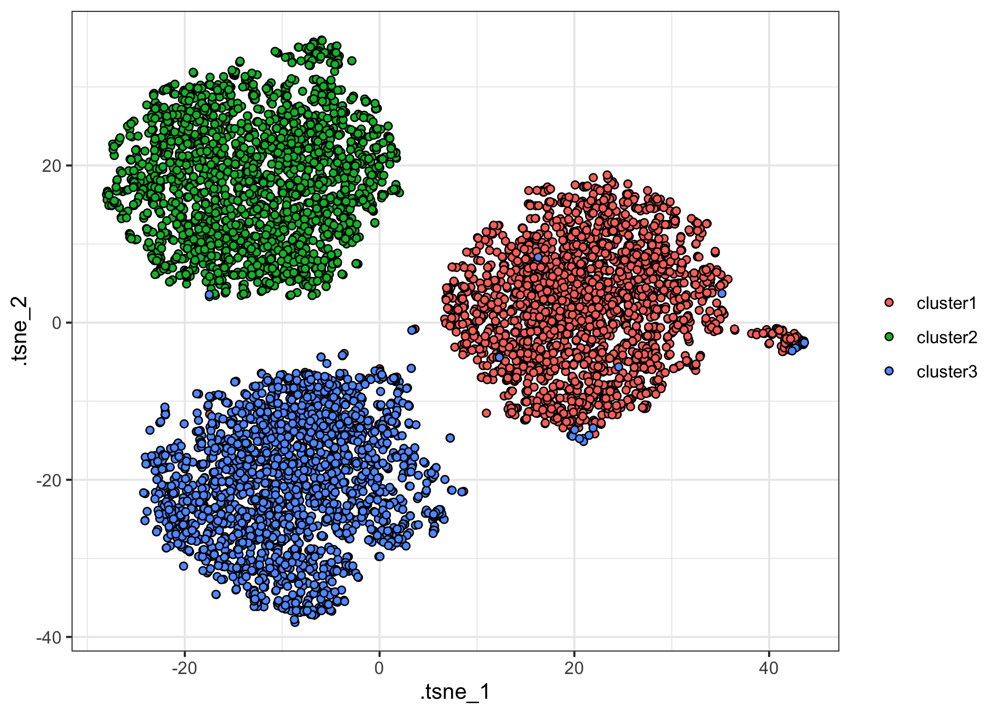
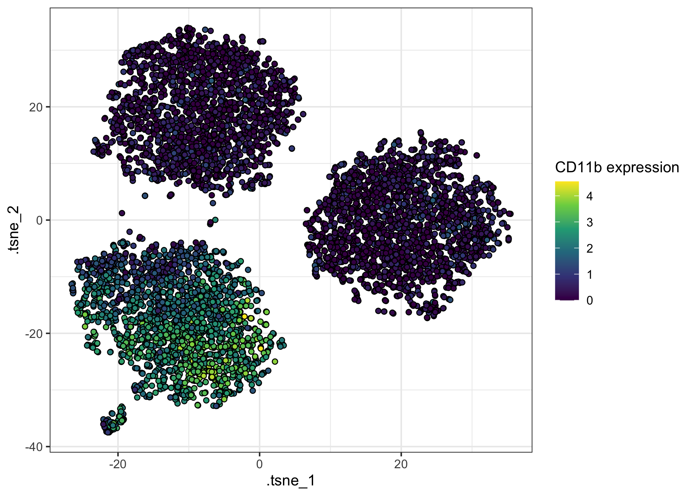
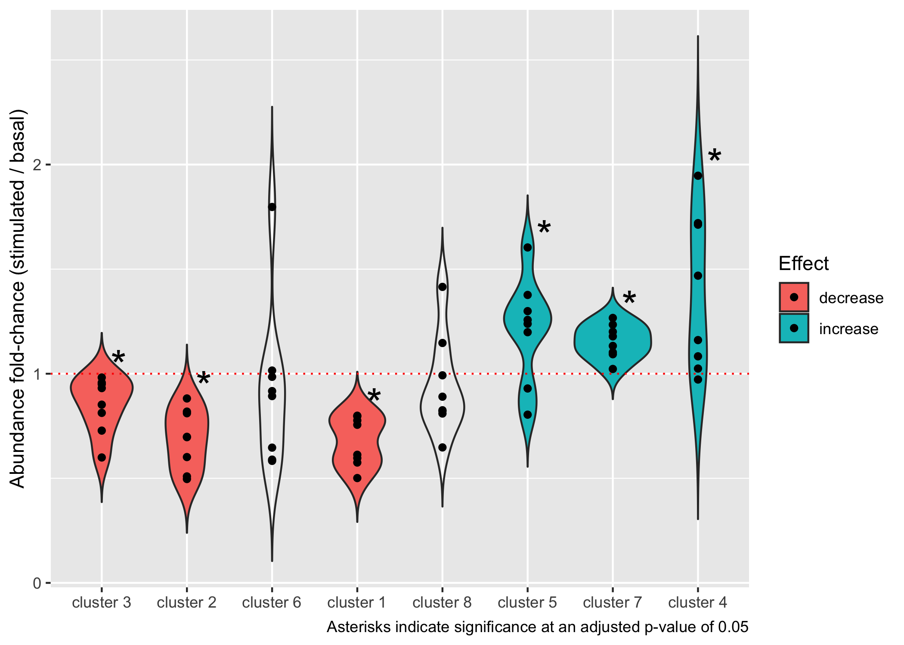

<!-- README.md is generated from README.Rmd. Please edit that file -->

# tidytof: An ecosystem for tidy and highly-reproducible CyTOF data analysis

<!-- badges: start -->

[](https://github.com/keyes-timothy/tidytof/actions)
[](https://app.codecov.io/gh/keyes-timothy/tidytof?branch=main)

<!-- badges: end -->

The goal of `tidytof` is to provide an integrated suite of R functions
for CyTOF data analysis using an intuitive and internally consistent set
of design principles. As an extension of the `tidyverse` ecosystem of
data manipulation tools in R, `tidytof` is both performant and
easy-to-use for scientists with a wide range of coding experience
(including beginners).

## Installation

You can install the development version of tidytof from GitHub with the
following command:

``` r
if(!require(devtools)) install.packages("devtools") 
devtools::install_github("keyes-timothy/tidytof")
```

Once `{tidytof}` is installed, you can attach it to your current R
session using the following code:

``` r
library(tidytof)
```

In addition, we can load the other packages we need for this vignette:

``` r
library(tidyverse)
```

## Usage

### Reading data (including example datasets)

`{tidytof}` comes bundled with several example mass cytometry datasets.
To access the raw .fcs and .csv files containing these data, use the
`tidytof_example_data` function. When called with no arguments,
`tidytof_example_data` will return a character vector naming the
datasets contained in {tidytof}:

``` r
tidytof_example_data()
#> [1] "aml"                  "ddpr"                 "mix"                 
#> [4] "mix2"                 "phenograph"           "phenograph_csv"      
#> [7] "scaffold"             "statistical_scaffold" "surgery"
```

To obtain the file path for the directory containing each dataset, call
`tidytof_example_data` with one of these dataset names as its argument.
For example, to obtain the directory for the phenograph data, we would
use the following command:

``` r
tidytof_example_data("phenograph")
#> [1] "/Library/Frameworks/R.framework/Versions/4.1/Resources/library/tidytof/extdata/phenograph"
```

Using one of these directories (or any other directory containing CyTOF
data on your local machine), we can use `tof_read_data` to read CyTOF
data from raw files. `tof_read_data` is smart enough to read single
.fcs/.csv files or multiple .fcs/.csv files depending on whether its
first argument (`path`) leads to a single file or to a directory of
files.

Here, we can use `tof_read_data` to read in all of the .fcs files in the
“phenograph” example dataset bundled into `{tidytof}` and store it in
the `phenograph` variable.

``` r
phenograph <- 
  tidytof_example_data("phenograph") %>% 
  tof_read_data()

phenograph %>% 
  head()
#> # A tibble: 6 × 45
#>   file_name   `Time|Time` `Cell_length|Ce… `DNA1|Ir191` `DNA2|Ir193` `BC1|Pd104`
#>   <chr>             <dbl>            <dbl>        <dbl>        <dbl>       <dbl>
#> 1 H1_PhenoGr…         462               24         338.         663.        47.4
#> 2 H1_PhenoGr…        5856               29         277.         577.       214. 
#> 3 H1_PhenoGr…        7621               25         289.         679.       223. 
#> 4 H1_PhenoGr…        8783               24         215.         393.        62.8
#> 5 H1_PhenoGr…       10106               29         135.         342.        25.6
#> 6 H1_PhenoGr…       11326               22         181.         393.        34.5
#> # … with 39 more variables: BC2|Pd106 <dbl>, BC3|Pd108 <dbl>, BC4|In113 <dbl>,
#> #   BC5|In115 <dbl>, BC6|La139 <dbl>, pPLCg2|Pr141 <dbl>, CD19|Nd142 <dbl>,
#> #   p4EBP1|Nd143 <dbl>, CD11b|Nd144 <dbl>, pAMPK|Nd145 <dbl>,
#> #   pSTAT3|Nd146 <dbl>, CD34|Nd148 <dbl>, pSTAT5|Nd150 <dbl>, pS6|Sm147 <dbl>,
#> #   pCREB|Sm149 <dbl>, pc-Cbl|Sm152 <dbl>, CD45|Sm154 <dbl>, CD123|Eu151 <dbl>,
#> #   pSTAT1|Eu153 <dbl>, pZap70-Syk|Gd156 <dbl>, CD33|Gd158 <dbl>,
#> #   CD47|Gd160 <dbl>, pAKT|Tb159 <dbl>, CD7|Dy162 <dbl>, CD15|Dy164 <dbl>, …
```

Regardless of its input format, `{tidytof}` reads data into an extended
`tibble` called a `tof_tbl`, an S3 class identical to `tbl_df`, but with
one additional attribute (“panel”). `{tidytof}` stores this additional
attribute in `tof_tbl`s because, in addition to analyzing CyTOF data
from individual experiments, CyTOF users often want to compare panels
between experiments to find common markers or to compare which metals
are associated with particular markers across panels.

A few notes about `tof_tbl`’s:

-   `tof_tbl`s contains one cell per row and one channel per column (to
    provide the data in its “tidy” format).
-   `tof_read_data` adds an additional column to the output `tof_tbl`
    encoding the name of the file from which each cell was read (the
    “file\_name” column).
-   Because `tof_tbl`s inherit from the `tbl_df` class, all methods
    available to tibbles are also available to `tof_tbl`s. For example,
    `{dplyr}`’s useful `mutate` method can be applied to our `tof_tbl`
    named `phenograph` above to convert the columns encoding the
    phenograph cluster and stimulation condition to which each cell
    belongs into character vectors (instead of their original numeric
    codes in the uncleaned dataset).

``` r
phenograph <- 
  phenograph %>% 
  # mutate the input tof_tbl
  mutate(
    `PhenoGraph|PhenoGraph` = as.character(`PhenoGraph|PhenoGraph`), 
    `Condition|Condition` = as.character(`Condition|Condition`)
  )

phenograph %>% 
  # use dplyr's select method to show that the columns have been changed
  select(where(is.character))
#> # A tibble: 77,563 × 3
#>    file_name              `PhenoGraph|PhenoGraph` `Condition|Condition`
#>    <chr>                  <chr>                   <chr>                
#>  1 H1_PhenoGraph_cluster1 1                       1                    
#>  2 H1_PhenoGraph_cluster1 1                       1                    
#>  3 H1_PhenoGraph_cluster1 1                       1                    
#>  4 H1_PhenoGraph_cluster1 1                       1                    
#>  5 H1_PhenoGraph_cluster1 1                       1                    
#>  6 H1_PhenoGraph_cluster1 1                       1                    
#>  7 H1_PhenoGraph_cluster1 1                       1                    
#>  8 H1_PhenoGraph_cluster1 1                       1                    
#>  9 H1_PhenoGraph_cluster1 1                       1                    
#> 10 H1_PhenoGraph_cluster1 1                       1                    
#> # … with 77,553 more rows
```

The `tof_tbl` class is preserved even after these transformations.

``` r
phenograph %>% 
  class()
#> [1] "tof_tbl"    "tbl_df"     "tbl"        "data.frame"
```

Finally, to retrieve panel information from a `tof_tbl`, use
`tof_get_panel`:

``` r
phenograph %>% 
  tof_get_panel()
#> # A tibble: 44 × 2
#>    metals      antigens   
#>    <chr>       <chr>      
#>  1 Time        Time       
#>  2 Cell_length Cell_length
#>  3 Ir191       DNA1       
#>  4 Ir193       DNA2       
#>  5 Pd104       BC1        
#>  6 Pd106       BC2        
#>  7 Pd108       BC3        
#>  8 In113       BC4        
#>  9 In115       BC5        
#> 10 La139       BC6        
#> # … with 34 more rows
```

Importantly, `tof_read_data` uses an opinionated heuristic to mine
different keyword slots of input .fcs file(s) and guess which metals and
antigens were used during data collection. Thus, when .csv files are
being read using `tof_read_data`, it is recommended to use the
`panel_info` argument to provide the panel manually (as .csv files,
unlike .fcs files, do not provide built-in metadata about the columns
they contain).

### Pre-processing

Generally, the raw ion counts for each analyte measured on a mass
cytometer need to be transformed before CyTOF data analysis. Common
preprocessing steps may include variance-stabilizing transformations -
such as the hyperbolic arcsine (arcsinh) transformation or a log
transformation - scaling/centering, and/or denoising.

To perform standard preprocessing tasks with `{tidytof}`, use
`tof_preprocess`. `tof_preprocess`’s default behavior is to apply the
arcsinh transformation (with a cofactor of 5) to each numeric column in
the input `tof_tibble` as well as to remove the gaussian noise that
Fluidigm software adds to each ion count (this noise is added for
visualization purposes, but for most analyses, removing it is
recommended).

As an example, we can preprocess our `phenograph` `tof_tibble` above and
see how our first few measurements change before and after.

``` r
# before preprocessing
phenograph %>% 
  select(`CD45|Sm154`, `CD34|Nd148`, `CD38|Er167`) %>% 
  head()
#> # A tibble: 6 × 3
#>   `CD45|Sm154` `CD34|Nd148` `CD38|Er167`
#>          <dbl>        <dbl>        <dbl>
#> 1        857.         4.76         10.7 
#> 2         71.9       -0.392        23.2 
#> 3        434.         4.33          5.70
#> 4         70.4        1.19          7.96
#> 5        356.         0.807        11.2 
#> 6        146.         0.145        44.3
```

``` r
# perform preprocessing
phenograph <- 
  phenograph %>% 
  tof_preprocess()

# visualize new values
phenograph %>% 
  select(`CD45|Sm154`, `CD34|Nd148`, `CD38|Er167`) %>% 
  head()
#> # A tibble: 6 × 3
#>   `CD45|Sm154` `CD34|Nd148` `CD38|Er167`
#>          <dbl>        <dbl>        <dbl>
#> 1         5.84        0.881         1.53
#> 2         3.36        0             2.27
#> 3         5.16        0.881         1.02
#> 4         3.35        0.390         1.25
#> 5         4.96        0.199         1.61
#> 6         4.07        0.199         2.89
```

To alter `tof_preprocess`’s default behavior, change the `channel_cols`
argument (to specify which columns of `tof_tibble` should be
transformed) and the `transform_fun` argument (to specify which
vector-valued function should be used to transform each of the
`channel_cols`). To keep the gaussian noise added by Fluidigm software
(or if you are working with a dataset that does not have this noise),
set the `undo_noise` argument to `FALSE`.

### Downsampling

Often, CyTOF experiments collect tens or hundreds or millions of cells
in total, and it can be useful to downsample to a smaller, more
computationally tractable number of cells - either for a final analysis
or while developing code. To do this, `{tidytof}` implements the
`tof_downsample` verb, which allows downsampling using 3 methods.

Using `{tidytof}`’s built-in dataset `phenograph_data` (which is a
smaller version of the dataset we read in ourselves above), we can see
that the original size of the dataset is 2000 cells per cluster, or 6000
cells in total:

``` r
phenograph_data %>% 
  count(phenograph_cluster)
#> # A tibble: 3 × 2
#>   phenograph_cluster     n
#>   <chr>              <int>
#> 1 cluster1            2000
#> 2 cluster2            2000
#> 3 cluster3            2000
```

To randomly sample 200 cells per cluster, we can use `tof_downsample`
using the “constant” `method`:

``` r
phenograph_data %>% 
  # downsample 
  tof_downsample(
    method = "constant", 
    group_cols = phenograph_cluster, 
    num_cells = 200
  ) %>% 
  # count the number of downsampled cells in each cluster
  count(phenograph_cluster)
#> # A tibble: 3 × 2
#>   phenograph_cluster     n
#>   <chr>              <int>
#> 1 cluster1             200
#> 2 cluster2             200
#> 3 cluster3             200
```

Alternatively, if we wanted to sample 50% of the cells in each cluster,
we could use the “prop” `method`:

``` r
phenograph_data %>% 
  # downsample
  tof_downsample(
    method = "prop",
    group_cols = phenograph_cluster, 
    prop_cells = 0.5
  ) %>% 
  # count the number of downsampled cells in each cluster
  count(phenograph_cluster)
#> # A tibble: 3 × 2
#>   phenograph_cluster     n
#>   <chr>              <int>
#> 1 cluster1            1000
#> 2 cluster2            1000
#> 3 cluster3            1000
```

Alternatively, you might be interested in taking a slightly different
approach to downsampling that downsamples the number of cells not to a
fixed constant or proportion, but to a fixed *density* in phenotypic
space. For example, the following scatterplot demonstrates that there
are certain areas of phenotypic density in `phenograph_data` that
contain more cells than others along the cd34/cd38 axes:

``` r
phenograph_data %>% 
  # preprocess all numeric columns in the dataset
  tof_preprocess(undo_noise = FALSE) %>% 
  # make a scatterplot
  ggplot(aes(x = cd34, y = cd38)) + 
  geom_point(alpha = 0.5) + 
  scale_x_continuous(limits = c(NA, 1.5)) + 
  scale_y_continuous(limits = c(NA, 4))
```


To reduce the number of cells in our dataset until the local density
around each cell in our dataset is relatively constant, we can use the
“density” `method` of `tof_downsample`:

``` r
phenograph_data %>% 
  tof_preprocess(undo_noise = FALSE) %>% 
  tof_downsample(method = "density", density_cols = c(cd34, cd38)) %>% 
  ggplot(aes(x = cd34, y = cd38)) + 
  geom_point(alpha = 0.5) + 
  scale_x_continuous(limits = c(NA, 1.5)) + 
  scale_y_continuous(limits = c(NA, 4))
```


For more details, check out the documentation for the 3 underlying
members of the `tof_downsample_*` function family (which are wrapped by
`tof_downsample`):

-   `tof_downsample_constant`
-   `tof_downsample_prop`
-   `tof_downsample_density`

### Clustering

Once input files are read into a tabular format and
preprocessed/downsampled, we might be interested in clustering our data
to define communities of cells with shared characteristics.

To do so, we can use the `tof_cluster` verb. Several clustering methods
are implemented in `{tidytof}`, including
[FlowSOM](https://pubmed.ncbi.nlm.nih.gov/25573116/),
[PhenoGraph](https://pubmed.ncbi.nlm.nih.gov/26095251/), k-means, and
others.

To demonstrate, we can apply the FlowSOM clustering algorithm to our
`phenograph_data` from above. Note that `phenograph_data` contains 6000
total cells (2000 each from 3 clusters identified in the [original
PhenoGraph publication](https://pubmed.ncbi.nlm.nih.gov/26095251/)).

``` r
phenograph_clusters <- 
  phenograph_data %>% 
  tof_preprocess() %>% 
  tof_cluster(method = "flowsom", cluster_cols = contains("cd"))

phenograph_clusters %>% 
  select(sample_name, .flowsom_metacluster, everything()) %>% 
  head()
#> # A tibble: 6 × 27
#>   sample_name   .flowsom_metaclu… phenograph_clus…  cd19 cd11b  cd34  cd45 cd123
#>   <chr>         <chr>             <chr>            <dbl> <dbl> <dbl> <dbl> <dbl>
#> 1 H1_PhenoGrap… 3                 cluster1         0.199  2.19 0      4.56 0.569
#> 2 H1_PhenoGrap… 3                 cluster1         0      2.92 0      5.33 1.61 
#> 3 H1_PhenoGrap… 3                 cluster1         0      1.99 0.390  4.62 0    
#> 4 H1_PhenoGrap… 3                 cluster1         0.881  1.53 0.199  4.61 1.02 
#> 5 H1_PhenoGrap… 3                 cluster1         0.881  2.05 0.199  4.80 0.733
#> 6 H1_PhenoGrap… 3                 cluster1         0      1.25 0.733  5.01 0.733
#> # … with 19 more variables: cd33 <dbl>, cd47 <dbl>, cd7 <dbl>, cd15 <dbl>,
#> #   cd44 <dbl>, cd38 <dbl>, cd3 <dbl>, cd117 <dbl>, cd64 <dbl>, cd41 <dbl>,
#> #   pstat3 <dbl>, pstat5 <dbl>, pampk <dbl>, p4ebp1 <dbl>, ps6 <dbl>,
#> #   pcreb <dbl>, pzap70-syk <dbl>, prb <dbl>, perk1-2 <dbl>
```

The output of `tof_cluster` is a `tof_tbl` identical to the input
tibble, now with the addition of an additional column
(“.flowsom\_metacluster”) that encodes the cluster id for each cell in
the input `tof_tbl`. Note that all output columns added to a tibble or
`tof_tbl` by `{tidytof}` begin with a full-stop (“.”) to reduce the
likelihood of collisions with existing column names.

Because the output of `tof_cluster` is a `tof_tbl`, we can use the
`count` method to assess the accuracy of the FlowSOM clustering compared
to the original clustering from the PhenoGraph paper.

``` r
phenograph_clusters %>% 
  count(phenograph_cluster, .flowsom_metacluster, sort = TRUE)
#> # A tibble: 6 × 3
#>   phenograph_cluster .flowsom_metacluster     n
#>   <chr>              <chr>                <int>
#> 1 cluster3           2                     1995
#> 2 cluster2           1                     1989
#> 3 cluster1           3                     1971
#> 4 cluster1           2                       29
#> 5 cluster2           2                       11
#> 6 cluster3           3                        5
```

Here, we can see that the FlowSOM algorithm groups most cells from the
same PhenoGraph cluster with one another (with a small number of
mistakes per PhenoGraph cluster).

To change which clustering algorithm `tof_cluster` uses, alter the
`method` flag; to change the columns used to compute the clusters,
change the `cluster_cols` flag. And finally, if you want to return a
`tibble` that only includes the cluster labels (not the cluster labels
added as a new column to the input `tof_tbl`), set `add_col` to `FALSE`.

``` r
# will result in a tibble with only 1 column (the cluster labels)
phenograph_data %>% 
  tof_preprocess() %>% 
  tof_cluster(method = "flowsom", cluster_cols = contains("cd"), add_col = FALSE) %>% 
  head()
#> # A tibble: 6 × 1
#>   .flowsom_metacluster
#>   <chr>               
#> 1 3                   
#> 2 3                   
#> 3 3                   
#> 4 3                   
#> 5 3                   
#> 6 3
```

### Dimensionality reduction

`{tidytof}` includes several algorithms for dimensionality reduction, a
process whereby high-dimensional datasets can be represented in a
smaller, easier-to-visualize number of dimensions. `{tidytof}` supports
3 dimensionality reduction methods: PCA, tSNE, and UMAP. To apply these
to a dataset, use `tof_reduce_dimensions`:

``` r
# perform the dimensionality reduction
phenograph_tsne <- 
  phenograph_clusters %>% 
  tof_reduce_dimensions(method = "tsne")

# select only the tsne embedding columns using a tidyselect helper (contains)
phenograph_tsne %>% 
  select(contains("tsne"))
#> # A tibble: 6,000 × 2
#>    .tsne_1 .tsne_2
#>      <dbl>   <dbl>
#>  1  -15.4   -2.19 
#>  2  -12.7   -4.00 
#>  3  -25.8    6.87 
#>  4  -10.9    1.40 
#>  5  -18.3    1.14 
#>  6  -17.8    0.222
#>  7  -18.2   -5.06 
#>  8  -29.6    2.22 
#>  9   -9.76   2.45 
#> 10  -21.2   14.9  
#> # … with 5,990 more rows
```

By default, `tof_reduce_dimensions` will add reduced-dimension feature
embeddings to the input `tof_tbl` and return the augmented `tof_tbl` as
its result. To return only the features embeddings themselves, set
`add_cols` to `FALSE` (as in `tof_cluster`).

Regardless of the method used, reduced-dimension feature embeddings can
be used for visualization using `{ggplot2}` (or any graphics package):

``` r
# plot the tsne embeddings using color to distinguish between clusters
phenograph_tsne %>% 
  ggplot(aes(x = .tsne_1, y = .tsne_2, fill = phenograph_cluster)) + 
  geom_point(shape = 21) + 
  theme_bw() + 
  labs(fill = NULL)
```



``` r
# plot the tsne embeddings using color to represent CD11b expression
phenograph_tsne %>% 
  ggplot(aes(x = .tsne_1, y = .tsne_2, fill = cd11b)) + 
  geom_point(shape = 21) + 
  scale_fill_viridis_c() +
  theme_bw() + 
  labs(fill = "CD11b expression")
```



Such visualizations can be helpful in qualitatively describing the
phenotypic distinctions between the clusters present in a dataset.

### Differential Discovery Analysis

While dimensionality reduction can be used to visualize a clustering
result, many CyTOF users also want to use statistical tools to
rigorously quantify which clusters(s) in their dataset associated with a
particular experimental or clinical variable.

Such analyses are often grouped under the umbrella term **differential
discovery analysis** and include both comparing the relative *size* of
clusters between experimental conditions (**differential abundance
analysis; DAA**) as well as comparing marker expression patterns of
clusters between experimental conditions (**differential expression
analysis; DEA**). `{tidytof}` provides the `tof_daa` and `tof_dea` verbs
for differential abundance and differential expression analyses,
respectively.

To demonstrate how to use these verbs, we’ll first download a dataset
originally collected for the development of the
[CITRUS](https://www.ncbi.nlm.nih.gov/pmc/articles/PMC4084463/)
algorithm. These data are available in the `{HDCytoData}` package, which
is available on Bioconductor and can be downloaded with the following
command:

``` r
if (!requireNamespace("BiocManager", quietly = TRUE))
    install.packages("BiocManager")

BiocManager::install("HDCytoData")
```

To load the CITRUS data into our current R session, we can call a
function from the `{HDCytoData}`, which will provide it to us in a
format from the `{flowCore}` package (called a “flowSet”). To convert
this into a tidy tibble, we can use `{tidytof}` built-in method for
converting flowCore objects into `tof_tbl`’s .

``` r
citrus_raw <- HDCytoData::Bodenmiller_BCR_XL_flowSet()

citrus_data <- 
  citrus_raw %>% 
  as_tof_tbl(sep = "_")

dim(citrus_data)
#> [1] 172791     39
```

Thus, we can see that `citrus_data` is a `tof_tbl` with 172791 cells
(one in each row) and 39 pieces of information about each cell (one in
each column).

We can also extract some metadata from the raw data and join it with our
single-cell data using some `tidyverse` functions:

``` r
citrus_metadata <- 
  tibble(
    file_name = as.character(flowCore::pData(citrus_raw)[[1]]), 
    sample_id = 1:length(file_name),
    patient = str_extract(file_name, "patient[:digit:]"), 
    stimulation = str_extract(file_name, "(BCR-XL)|Reference")
  ) %>% 
  mutate(
    stimulation = if_else(stimulation == "Reference", "Basal", stimulation)
  )

citrus_metadata %>%
  head()
#> # A tibble: 6 × 4
#>   file_name                          sample_id patient  stimulation
#>   <chr>                                  <int> <chr>    <chr>      
#> 1 PBMC8_30min_patient1_BCR-XL.fcs            1 patient1 BCR-XL     
#> 2 PBMC8_30min_patient1_Reference.fcs         2 patient1 Basal      
#> 3 PBMC8_30min_patient2_BCR-XL.fcs            3 patient2 BCR-XL     
#> 4 PBMC8_30min_patient2_Reference.fcs         4 patient2 Basal      
#> 5 PBMC8_30min_patient3_BCR-XL.fcs            5 patient3 BCR-XL     
#> 6 PBMC8_30min_patient3_Reference.fcs         6 patient3 Basal
```

Finally, we can join the metadata with our single-cell `tof_tbl` to
obtain the cleaned dataset.

``` r
citrus_data <- 
  citrus_data %>% 
  left_join(citrus_metadata, by = "sample_id")
```

After this data cleaning, we have `citrus_data`, a `tof_tbl` containing
cells collected from 8 patients. Specifically, 2 samples were taken from
each patient: one in which the cells’ B-cell receptors were stimulated
(BCR-XL) and one in which they were not (Basal). In `citrus_data`, each
cell’s patient of origin is stored in the `patient` column, and each
cell’s stimulation condition is stored in the `stimulation` column. In
addition, the `population_id` column stores information about cluster
labels that were applied to each cell using a combination of FlowSOM
clustering and manual merging (for details, run
`?HDCytoData::Bodenmiller_BCR_XL` in the R console).

We might be interested if there are certain clusters that expand or
deplete within patients between the two stimulation conditions described
above - this is a question of differential abundance analysis (DAA).
`{tidytof}`’s `tof_daa` verb supports the use of 3 statistical
approaches for performing DAA: diffcyt, generalized-linear mixed
modeling (GLMMs), and simple t-tests. Because the setup described above
uses a paired design and only has 2 experimental conditions of interest
(Basal vs. BCR-XL), we can use the paired t-test method:

``` r
daa_result <- 
  citrus_data %>% 
  tof_daa(
    daa_method = "ttest", 
    cluster_col = population_id, 
    effect_col = stimulation, 
    group_cols = patient, 
    test_type = "paired"
  )

daa_result
#> # A tibble: 8 × 8
#>   population_id      t    df    p_val   p_adj significant mean_diff mean_fc
#>   <chr>          <dbl> <dbl>    <dbl>   <dbl> <chr>           <dbl>   <dbl>
#> 1 1             -5.48      7 0.000924 0.00535 "*"          -0.00743   0.644
#> 2 2             -3.86      7 0.00623  0.0166  "*"          -0.0156    0.674
#> 3 3             -2.88      7 0.0235   0.0314  "*"          -0.0638    0.849
#> 4 4              2.88      7 0.0235   0.0314  "*"           0.0832    1.38 
#> 5 5              3.39      7 0.0116   0.0232  "*"           0.00246   1.08 
#> 6 6             -0.955     7 0.371    0.371   ""           -0.0168    0.919
#> 7 7              5.14      7 0.00134  0.00535 "*"           0.0202    1.14 
#> 8 8             -1.30      7 0.236    0.270   ""           -0.00228   0.901
```

Based on this output, we can see that 6 of our 8 clusters have
statistically different abundance in our two stimulation conditions.
Using `{tidytof}` easy integration with `{tidyverse}` packages, we can
use this result to visualize the fold-changes of each cluster (within
each patient) in the BCR-XL condition compared to the Basal condition
using `{ggplot2}`:

``` r
plot_data <- 
  citrus_data %>% 
  mutate(population_id = as.character(population_id)) %>%
  left_join(
    select(daa_result, population_id, significant, mean_fc), 
    by = "population_id"
  ) %>% 
  dplyr::count(patient, stimulation, population_id, significant, mean_fc, name = "n") %>% 
  group_by(patient, stimulation) %>% 
  mutate(prop = n / sum(n)) %>% 
  ungroup() %>% 
  pivot_wider(
    names_from = stimulation, 
    values_from = c(prop, n), 
  ) %>% 
  mutate(
    diff = `prop_BCR-XL` - prop_Basal, 
    fc = `prop_BCR-XL` / prop_Basal,
    population_id = fct_reorder(population_id, diff),
    direction = 
      case_when(
        mean_fc > 1 & significant == "*" ~ "increase",
        mean_fc < 1 & significant == "*" ~ "decrease", 
        TRUE ~ NA_character_
      )
  ) 

significance_data <- 
  plot_data %>% 
  group_by(population_id, significant, direction) %>% 
  summarize(diff = max(diff), fc = max(fc)) %>% 
  ungroup()

significance_data
#> # A tibble: 8 × 5
#>   population_id significant direction     diff    fc
#>   <fct>         <chr>       <chr>        <dbl> <dbl>
#> 1 3             "*"         decrease  -0.00587 0.982
#> 2 2             "*"         decrease  -0.00526 0.882
#> 3 6             ""          <NA>       0.0676  1.80 
#> 4 1             "*"         decrease  -0.00288 0.799
#> 5 8             ""          <NA>       0.00571 1.42 
#> 6 5             "*"         increase   0.00520 1.60 
#> 7 7             "*"         increase   0.0386  1.27 
#> 8 4             "*"         increase   0.224   1.95

plot_data %>% 
  ggplot(aes(x = population_id, y = fc, fill = direction)) + 
  geom_violin(trim = FALSE) +
  geom_hline(yintercept = 1, color = "red", linetype = "dotted", size = 0.5) + 
  geom_point() + 
  geom_text(
    aes(x = population_id, y = fc, label = significant), 
    data = significance_data, 
    size = 8, 
    nudge_x = 0.2,
    nudge_y = 0.06
  ) +
  scale_x_discrete(labels = function(x) str_c("cluster ", x)) + 
  scale_fill_discrete(na.translate = FALSE) + 
  labs(
    x = NULL, 
    y = "Abundance fold-chance (stimulated / basal)", 
    fill = "Effect", 
    caption = "Asterisks indicate significance at an adjusted p-value of 0.05"
  )
```



Importantly, the output of `tof_daa` depends slightly on the underlying
statistical method being used, and details can be found in the
documentation for each `tof_daa_*` function family member:

-   `tof_daa_diffcyt`
-   `tof_daa_glmm`
-   `tof_daa_ttest`

Similarly, suppose we’re interested in how intracellular signaling
proteins change their expression levels between our two stimulation
conditions in each of our clusters. This is a Differential Expression
Analysis (DEA) and can be performed using `{tidytof}`’s `tof_dea` verb.
As above, we can use paired t-tests with multiple-hypothesis correction
to to test for significant differences in each of our signaling markers.

``` r
signaling_markers <- 
  c(
    "pNFkB_Nd142", "pStat5_Nd150", "pAkt_Sm152", "pStat1_Eu153", "pStat3_Gd158", 
    "pSlp76_Dy164", "pBtk_Er166", "pErk_Er168", "pS6_Yb172", "pZap70_Gd156"
  )

dea_result <- 
  citrus_data %>% 
  tof_dea(
    dea_method = "ttest", 
    cluster_col = population_id, 
    marker_cols = any_of(signaling_markers), 
    effect_col = stimulation,
    group_cols = patient, 
    test_type = "paired"
  )

dea_result %>% 
  head()
#> # A tibble: 6 × 9
#>   population_id marker     t    df   p_val   p_adj significant mean_diff mean_fc
#>   <chr>         <chr>  <dbl> <dbl>   <dbl>   <dbl> <chr>           <dbl>   <dbl>
#> 1 3             pBtk_… -22.3     7 9.10e-8 7.28e-6 *               -4.50   0.273
#> 2 4             pBtk_… -17.5     7 4.89e-7 1.30e-5 *               -4.33   0.296
#> 3 7             pBtk_… -18.2     7 3.72e-7 1.30e-5 *               -4.76   0.273
#> 4 8             pBtk_… -13.4     7 2.95e-6 5.90e-5 *               -4.41   0.373
#> 5 2             pS6_Y…  11.3     7 9.52e-6 1.52e-4 *              157.     9.08 
#> 6 1             pAkt_…  11.0     7 1.14e-5 1.52e-4 *               21.9    1.72
```

While the output of `tof_dea` also depends on the underlying test being
used, we can see that the result above looks relatively similar to the
output from `tof_daa`. Above, the output is a tibble in which each row
represents the differential expression results from a single
cluster-marker pair - for example, the first row represents the
difference in expression of pBtk in cluster 3 between the BCR-XL and
Basal conditions. Each row includes the raw p-value and
multiple-hypothesis-corrected p-value for each cluster-marker pair.

This result can be used to make a volcano plot to visualize the results
for all cluster-marker pairs:

``` r
volcano_data <- 
  dea_result %>% 
  mutate(
    log2_fc = log(mean_fc, base = 2), 
    log_p = -log(p_adj), 
    significance = 
      case_when(
        p_adj < 0.05 & mean_fc > 1 ~ "increased", 
        p_adj < 0.05 & mean_fc < 1 ~ "decreased",
        TRUE ~ NA_character_
      ), 
    marker = 
      str_extract(marker, ".+_") %>% 
      str_remove("_"), 
    pair = str_c(marker, str_c("cluster ", population_id), sep = "@")
  )

volcano_data %>% 
  ggplot(aes(x = log2_fc, y = log_p, fill = significance)) + 
  geom_vline(xintercept = 0, linetype = "dashed", color = "gray50") + 
  geom_hline(yintercept = -log(0.05), linetype = "dashed", color = "red") +
  geom_point(shape = 21, size = 2) + 
  ggrepel::geom_text_repel(
    aes(label = pair), 
    data = slice_head(volcano_data, n = 10L), 
    size = 2
  ) + 
  scale_fill_manual(
    values = c("decreased" = "#cd5241", "increased" = "#207394"), 
    na.value = "#cdcdcd"
  ) + 
  labs(
    x = "log2(Fold-change)", 
    y = "-log10(p-value)", 
    fill = NULL
  )
```


### Patient-level feature extraction

\[Under construction\]

### Outcomes modeling

\[Under construction\]

### Post-processing

\[Under construction\]

### Writing data

\[Under construction\]
