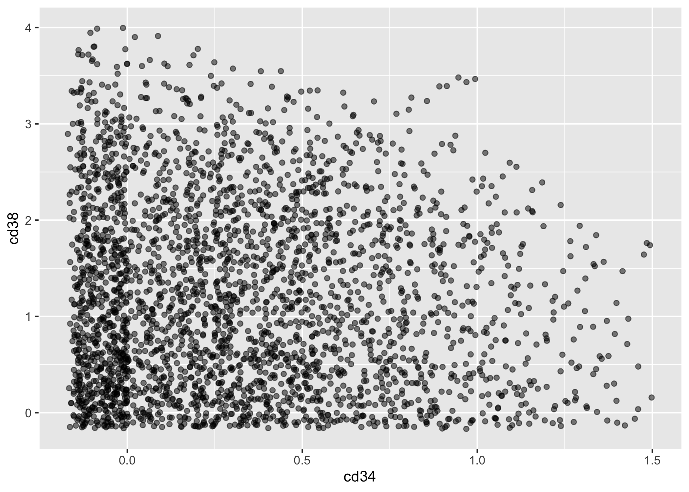
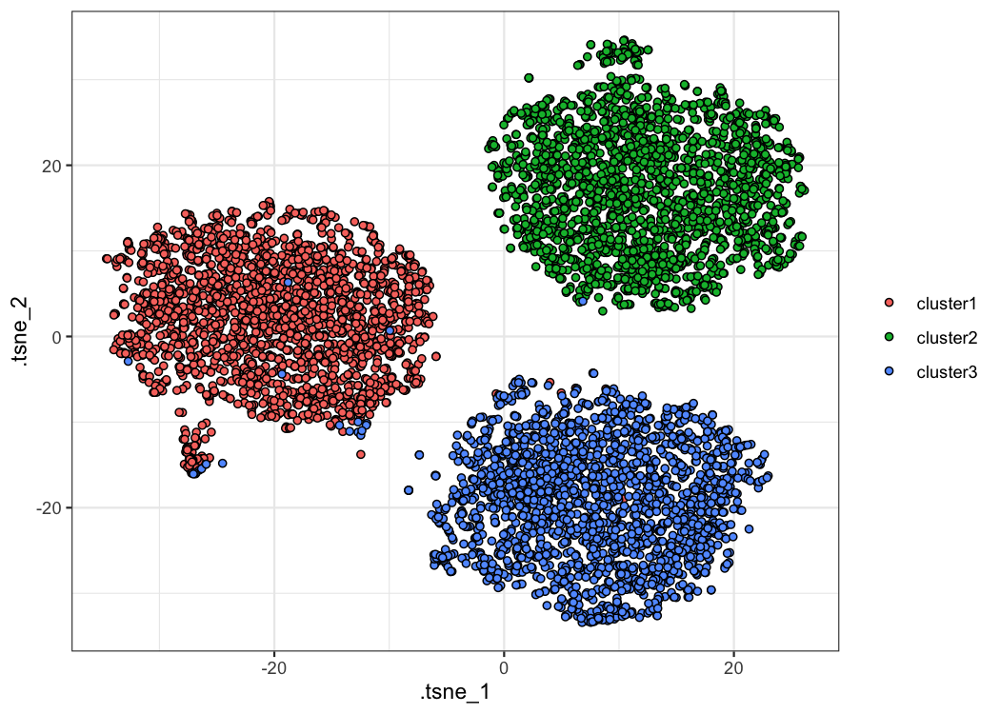
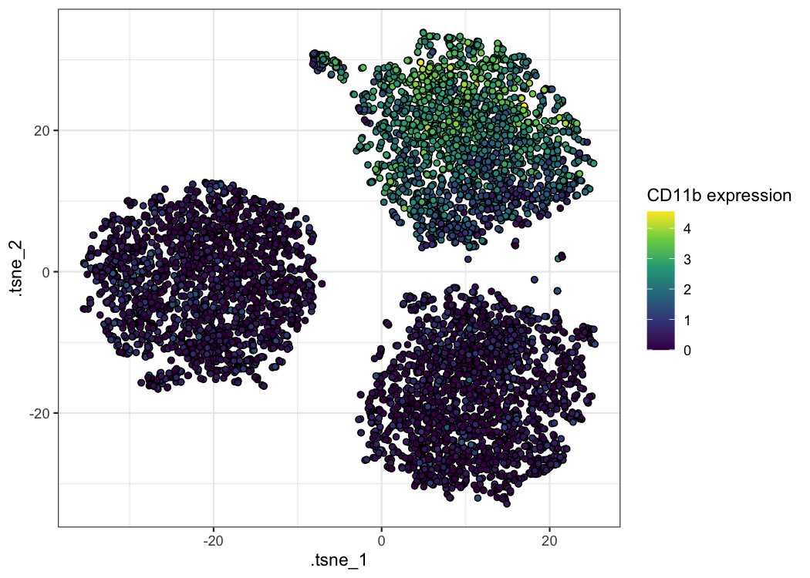
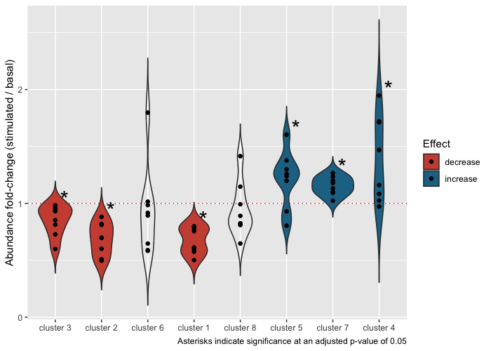
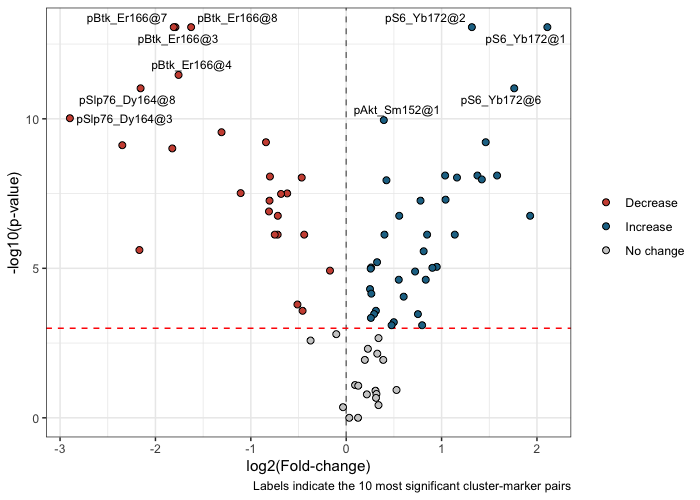
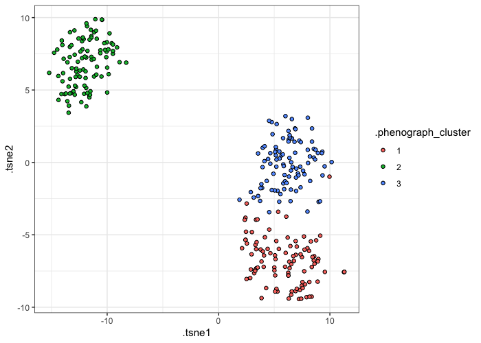

<!-- README.md is generated from README.Rmd. Please edit that file -->

# tidytof: A user-friendly framework for interactive and highly reproducible cytometry data analysis <a href='https://keyes-timothy.github.io/tidytof/index.html'></a>

<!-- badges: start -->

[](https://github.com/keyes-timothy/tidytof/actions)
[](https://github.com/keyes-timothy/tidytof/actions)
[](https://lifecycle.r-lib.org/articles/stages.html#experimental)
[](https://app.codecov.io/gh/keyes-timothy/tidytof?branch=main)
[](https://github.com/keyes-timothy/tidytof/actions/workflows/R-CMD-check.yaml)
<!-- badges: end -->

`{tidytof}` is an R package that implements an open-source, integrated
“grammar” of single-cell data analysis for high-dimensional cytometry
data (i.e. [mass
cytometry](https://www.ncbi.nlm.nih.gov/pmc/articles/PMC4860251/),
full-spectrum flow cytometry, and sequence-based cytometry).
Specifically, `{tidytof}` provides an easy-to-use pipeline for handling
high-dimensional cytometry data at multiple levels of observation - the
single-cell level, the cell subpopulation (or cluster) level, and the
whole-sample level - by automating many common data-processing tasks
under a common [“tidy data”](https://r4ds.had.co.nz/tidy-data.html)
interface.

As an extension of the `tidyverse` ecosystem of data manipulation tools
in R, all of `{tidytof}`’s functions have been developed with an
internally consistent, human-centered set of design principles. This
means that using `{tidytof}` should be equally intuitive among
scientists with a wide range of coding experience (including beginners).

## Getting started

### Prerequisites

`{tidytof}` makes heavy use of two concepts that R beginners may be
unfamiliar with. The first is the pipe (`|>`), which you can read about
[here](https://r4ds.had.co.nz/pipes.html). The second is “grouping” data
in a `data.frame` or `tibble` using `dplyr::group_by`, which you can
read about [here](https://dplyr.tidyverse.org/articles/grouping.html).

Everything else should be self-explanatory for beginner and advanced R
users, though if you have *zero* background in running R code, you
should read [this chapter](https://r4ds.had.co.nz/workflow-basics.html)
of [R for Data Science](https://r4ds.had.co.nz/index.html) by Hadley
Wickham.

### Package structure

Broadly speaking, `{tidytof}`’s functionality is organized to support 3
levels of analysis inherent in single-cell data:

1.  Reading, writing, preprocessing, and visualizing data at the level
    of **single cells**
2.  Identifying and describing cell **subpopulations** or **clusters**
3.  Building models (for inference or prediction) at the level of
    **patients** or **samples**

How to use `{tidytof}` at each of these levels of cytometry data
analysis is detailed in the “Usage” section below.

## Installation

You can install the development version of tidytof from GitHub with the
following command:

``` r
if(!require(devtools)) install.packages("devtools") 
devtools::install_github("keyes-timothy/tidytof")
```

Once `{tidytof}` is installed, you can attach it to your current R
session using the following code:

``` r
library(tidytof)
```

In addition, we can install and load the other packages we need for this
vignette:

``` r
if(!require(FlowSOM)) BiocManager::install("FlowSOM")
library(FlowSOM)

if(!require(tidyverse)) install.packages("tidyverse")
library(tidyverse)
```

## Usage

### Analyzing data at the single-cell level

#### Reading data with `tof_read_data`

`{tidytof}` comes bundled with several example mass cytometry datasets.
To access the raw .fcs and .csv files containing these data, use the
`tidytof_example_data` function. When called with no arguments,
`tidytof_example_data` will return a character vector naming the
datasets contained in `{tidytof}`:

``` r
tidytof_example_data()
#>  [1] "aml"                  "ddpr"                 "ddpr_metadata.csv"   
#>  [4] "mix"                  "mix2"                 "phenograph"          
#>  [7] "phenograph_csv"       "scaffold"             "statistical_scaffold"
#> [10] "surgery"
```

To obtain the file path for the directory containing each dataset, call
`tidytof_example_data` with one of these dataset names as its argument.
For example, to obtain the directory for the phenograph data, we would
use the following command:

``` r
tidytof_example_data("phenograph")
#> [1] "/Library/Frameworks/R.framework/Versions/4.3-x86_64/Resources/library/tidytof/extdata/phenograph"
```

Using one of these directories (or any other directory containing
cytometry data on your local machine), we can use `tof_read_data` to
read cytometry data from raw files. Acceptable formats include .fcs
files and .csv files. Importantly, `tof_read_data` is smart enough to
read single .fcs/.csv files or multiple .fcs/.csv files depending on
whether its first argument (`path`) leads to a single file or to a
directory of files.

Here, we can use `tof_read_data` to read in all of the .fcs files in the
“phenograph” example dataset bundled into `{tidytof}` and store it in
the `phenograph` variable.

``` r
phenograph <- 
  tidytof_example_data("phenograph") |> 
  tof_read_data()

phenograph |> 
  class()
#> [1] "tof_tbl"    "tbl_df"     "tbl"        "data.frame"
```

Regardless of its input format, `{tidytof}` reads data into an extended
`tibble` called a `tof_tbl` (pronounced “tof tibble”), an S3 class
identical to `tbl_df`, but with one additional attribute (“panel”).
`{tidytof}` stores this additional attribute in `tof_tbl`s because, in
addition to analyzing cytometry data from individual experiments,
cytometry users often want to compare panels between experiments to find
common markers or to compare which metals are associated with particular
markers across panels.

A few notes about `tof_tbl`s:

- `tof_tbl`s contains one cell per row and one cytometry channel per
  column (to provide the data in its “tidy” format).
- `tof_read_data` adds an additional column to the output `tof_tbl`
  encoding the name of the file from which each cell was read (the
  “file_name” column).
- Because `tof_tbl`s inherit from the `tbl_df` class, all methods
  available to tibbles are also available to `tof_tbl`s. For example,
  `{dplyr}`’s useful `mutate` method can be applied to our `tof_tbl`
  named `phenograph` above to convert the columns encoding the
  phenograph cluster ID and stimulation condition to which each cell
  belongs into character vectors (instead of their original numeric
  codes in the uncleaned dataset).

``` r
phenograph <- 
  phenograph |> 
  # mutate the input tof_tbl
  mutate(
    PhenoGraph = as.character(PhenoGraph), 
    Condition = as.character(Condition)
  )

phenograph |> 
  # use dplyr's select method to show that the columns have been changed
  select(where(is.character)) |> 
  head()
#> # A tibble: 6 × 3
#>   file_name                  PhenoGraph Condition
#>   <chr>                      <chr>      <chr>    
#> 1 H1_PhenoGraph_cluster1.fcs 7          7        
#> 2 H1_PhenoGraph_cluster1.fcs 6          6        
#> 3 H1_PhenoGraph_cluster1.fcs 9          9        
#> 4 H1_PhenoGraph_cluster1.fcs 2          2        
#> 5 H1_PhenoGraph_cluster1.fcs 15         15       
#> 6 H1_PhenoGraph_cluster1.fcs 12         12
```

The `tof_tbl` class is preserved even after these transformations.

``` r
phenograph |> 
  class()
#> [1] "tof_tbl"    "tbl_df"     "tbl"        "data.frame"
```

Finally, to retrieve panel information from a `tof_tbl`, use
`tof_get_panel`:

``` r
phenograph |> 
  tof_get_panel() |> 
  head()
#> # A tibble: 6 × 2
#>   metals      antigens   
#>   <chr>       <chr>      
#> 1 Time        Time       
#> 2 Cell_length Cell_length
#> 3 Ir191       DNA1       
#> 4 Ir193       DNA2       
#> 5 Pd104       BC1        
#> 6 Pd106       BC2
```

Importantly, `tof_read_data` uses an opinionated heuristic to mine
different keyword slots of the input .fcs file(s) and guess which metals
and antigens were used during data collection. Thus, when .csv files are
being read using `tof_read_data`, it is recommended to use the
`panel_info` argument to provide the panel manually (as .csv files,
unlike .fcs files, do not provide built-in metadata about the columns
they contain).

#### Pre-processing with `tof_preprocess`

Generally, the raw ion counts for each analyte measured on a mass
cytometer need to be transformed before cytometry data analysis. Common
preprocessing steps may include variance-stabilizing transformations -
such as the hyperbolic arcsine (arcsinh) transformation or a log
transformation - scaling/centering, and/or denoising.

To perform standard preprocessing tasks with `{tidytof}`, use
`tof_preprocess`. `tof_preprocess`’s default behavior is to apply the
arcsinh transformation (with a cofactor of 5) to each numeric column in
the input `tof_tibble` as well as to remove the gaussian noise that
Fluidigm software adds to each ion count (this noise is added for
visualization purposes, but for most analyses, removing it is
recommended).

As an example, we can preprocess our `phenograph` `tof_tibble` above and
see how our first few measurements change before and after.

``` r
# before preprocessing
phenograph |> 
  select(`CD45|Sm154`, `CD34|Nd148`, `CD38|Er167`) |> 
  head()
#> # A tibble: 6 × 3
#>   `CD45|Sm154` `CD34|Nd148` `CD38|Er167`
#>          <dbl>        <dbl>        <dbl>
#> 1        440.         0.256        18.7 
#> 2        705.         1.96         41.2 
#> 3        383.        -0.302         6.51
#> 4         44.4        2.74         27.2 
#> 5        892.         4.08         24.5 
#> 6        448.         2.69         11.1
```

``` r
# perform preprocessing
phenograph <- 
  phenograph |> 
  tof_preprocess()

# inspect new values
phenograph |> 
  select(`CD45|Sm154`, `CD34|Nd148`, `CD38|Er167`) |> 
  head()
#> # A tibble: 6 × 3
#>   `CD45|Sm154` `CD34|Nd148` `CD38|Er167`
#>          <dbl>        <dbl>        <dbl>
#> 1         5.17       0.0512         2.03
#> 2         5.64       0.382          2.81
#> 3         5.03      -0.0603         1.08
#> 4         2.88       0.524          2.40
#> 5         5.88       0.746          2.29
#> 6         5.19       0.515          1.54
```

To alter `tof_preprocess`’s default behavior, change the `channel_cols`
argument (to specify which columns of `tof_tibble` should be
transformed) and the `transform_fun` argument (to specify which
vector-valued function should be used to transform each of the
`channel_cols`). To keep the gaussian noise added by Fluidigm software
(or if you are working with a dataset that does not have this noise),
set the `undo_noise` argument to `FALSE`.

Finally, note that the built-in function `tof_postprocess` works nearly
identically `tof_preprocess`, but provides different default behavior
(namely, applying the reverse arcsinh transformation with a cofactor of
5 to all numeric columns. See `?tof_postprocess` for details).

#### Downsampling with `tof_downsample`

Often, cytometry experiments collect tens or hundreds or millions of
cells in total, and it can be useful to downsample to a smaller, more
computationally tractable number of cells - either for a final analysis
or while developing code. To do this, `{tidytof}` implements the
`tof_downsample` verb, which allows downsampling using 3 methods.

Using `{tidytof}`’s built-in dataset `phenograph_data` (which is a
smaller version of the dataset we read in ourselves above), we can see
that the original size of the dataset is 1000 cells per cluster, or 3000
cells in total:

``` r
data(phenograph_data)

phenograph_data |> 
  count(phenograph_cluster)
#> # A tibble: 3 × 2
#>   phenograph_cluster     n
#>   <chr>              <int>
#> 1 cluster1            1000
#> 2 cluster2            1000
#> 3 cluster3            1000
```

To randomly sample 200 cells per cluster, we can use `tof_downsample`
using the “constant” `method`:

``` r
phenograph_data |> 
  # downsample 
  tof_downsample(
    method = "constant", 
    group_cols = phenograph_cluster, 
    num_cells = 200
  ) |> 
  # count the number of downsampled cells in each cluster
  count(phenograph_cluster)
#> # A tibble: 3 × 2
#>   phenograph_cluster     n
#>   <chr>              <int>
#> 1 cluster1             200
#> 2 cluster2             200
#> 3 cluster3             200
```

Alternatively, if we wanted to sample 50% of the cells in each cluster,
we could use the “prop” `method`:

``` r
phenograph_data |> 
  # downsample
  tof_downsample(
    method = "prop",
    group_cols = phenograph_cluster, 
    prop_cells = 0.5
  ) |> 
  # count the number of downsampled cells in each cluster
  count(phenograph_cluster)
#> # A tibble: 3 × 2
#>   phenograph_cluster     n
#>   <chr>              <int>
#> 1 cluster1             500
#> 2 cluster2             500
#> 3 cluster3             500
```

And finally, you might also be interested in taking a slightly different
approach to downsampling that downsamples the number of cells not to a
fixed constant or proportion, but to a fixed *density* in phenotypic
space. For example, the following scatterplot demonstrates that there
are certain areas of phenotypic density in `phenograph_data` that
contain more cells than others along the `cd34`/`cd38` axes:

``` r
phenograph_data |> 
  # preprocess all numeric columns in the dataset
  tof_preprocess(undo_noise = FALSE) |> 
  # make a scatterplot
  ggplot(aes(x = cd34, y = cd38)) + 
  geom_point(alpha = 0.5) + 
  scale_x_continuous(limits = c(NA, 1.5)) + 
  scale_y_continuous(limits = c(NA, 4)) + 
  theme_bw()
```


To reduce the number of cells in our dataset until the local density
around each cell in our dataset is relatively constant, we can use the
“density” `method` of `tof_downsample`:

``` r
phenograph_data |> 
  tof_preprocess(undo_noise = FALSE) |> 
  tof_downsample(
    density_cols = c(cd34, cd38), 
    target_prop_cells = 0.25, 
    method = "density", 
  ) |> 
  ggplot(aes(x = cd34, y = cd38)) + 
  geom_point(alpha = 0.5) + 
  scale_x_continuous(limits = c(NA, 1.5)) + 
  scale_y_continuous(limits = c(NA, 4)) + 
  theme_bw()
```



For more details, check out the documentation for the 3 underlying
members of the `tof_downsample_*` function family (which are wrapped by
`tof_downsample`):

- `tof_downsample_constant`
- `tof_downsample_prop`
- `tof_downsample_density`

#### Writing data with `tof_write_data`

Finally, users may wish to store single-cell data as .fcs or .csv files
after transformation, concatenation, filtering, or other data processing
steps such as dimensionality reduction and/or clustering (see below). To
write single-cell data from a `tof_tbl` into .fcs or .csv files, use
`tof_write_data`.

``` r
# when copying and pasting this code, feel free to change this path 
# to wherever you'd like to save your output files
my_path <- file.path("~", "Desktop", "tidytof_vignette_files")

phenograph_data |> 
  tof_write_data(
    group_cols = phenograph_cluster, 
    out_path = my_path,
    format = "fcs"
  )
```

`tof_write_data`’s trickiest argument is `group_cols`, the argument used
to specify which columns in `tof_tibble` should be used to group cells
(i.e. the rows of `tof_tibble`) into separate .fcs or .csv files. Simply
put, this argument allows `tof_write_data` to create a single .fcs or
.csv file for each unique combination of values in the columns specified
by the user. In the example above, cells are grouped into 3 output .fcs
files - one for each of the 3 clusters encoded by the
`phenograph_cluster` column in `phenograph_data`. These files should
have the following names (derived from the values in the
`phenograph_cluster` column):

- cluster1.fcs
- cluster2.fcs
- cluster3.fcs

However, suppose we wanted to write multiple files for each cluster by
breaking cells into two groups: those that express high levels of
`pstat5` and those that express low levels of `pstat5`. We can use
`dplyr::mutate` to create a new column in `phenograph_data` that breaks
cells into high- and low-`pstat5` expression groups, then add this
column to our `group_cols` specification:

``` r
phenograph_data |> 
  # create a variable representing if a cell is above or below the median 
  # expression level of pstat5
  mutate(expression_group = if_else(pstat5 > median(pstat5), "high", "low")) |> 
  tof_write_data(
    group_cols = c(phenograph_cluster, expression_group), 
    out_path = my_path, 
    format = "fcs"
  )
```

This will write 6 files with the following names (derived from the
values in `phenograph_cluster` and `expression_group`).

- cluster1_low.fcs
- cluster1_high.fcs
- cluster2_low.fcs
- cluster2_high.fcs
- cluster3_low.fcs
- cluster3_high.fcs

A useful feature of `tof_write_data` is that it will automatically
concatenate cells into single .fcs or .csv files based on the specified
`group_cols` *regardless of how many unique files those cells came
from*, allowing for easy concatenation of .fcs or .csv files containing
data from a single sample acquired over multiple cytometry runs.

### Analyzing data at the cluster-level

#### Identifying clusters with `tof_cluster`

Once input files are read into a tabular format and
preprocessed/downsampled, we might be interested in clustering our data
to define communities of cells with shared characteristics.

To do so, we can use the `tof_cluster` verb. Several clustering methods
are implemented in `{tidytof}`, including
[FlowSOM](https://pubmed.ncbi.nlm.nih.gov/25573116/),
[PhenoGraph](https://pubmed.ncbi.nlm.nih.gov/26095251/), k-means, and
others.

To demonstrate, we can apply the FlowSOM clustering algorithm to our
`phenograph_data` from above. Note that `phenograph_data` contains 6000
total cells (2000 each from 3 clusters identified in the [original
PhenoGraph publication](https://pubmed.ncbi.nlm.nih.gov/26095251/)).

``` r
phenograph_clusters <- 
  phenograph_data |> 
  tof_preprocess() |> 
  tof_cluster(method = "flowsom", cluster_cols = contains("cd"))

phenograph_clusters |> 
  select(sample_name, .flowsom_metacluster, everything()) |> 
  head()
#> # A tibble: 6 × 26
#>   sample_name      .flowsom_metacluster phenograph_cluster    cd19 cd11b    cd34
#>   <chr>            <chr>                <chr>                <dbl> <dbl>   <dbl>
#> 1 H1_PhenoGraph_c… 8                    cluster1           -0.0336 2.46   0.608 
#> 2 H1_PhenoGraph_c… 9                    cluster1            0.324  0.856 -0.116 
#> 3 H1_PhenoGraph_c… 8                    cluster1            0.532  2.67   0.909 
#> 4 H1_PhenoGraph_c… 2                    cluster1            0.0163 2.97   0.0725
#> 5 H1_PhenoGraph_c… 8                    cluster1            0.144  2.98   0.128 
#> 6 H1_PhenoGraph_c… 1                    cluster1            0.742  3.41   0.336 
#> # ℹ 20 more variables: cd45 <dbl>, cd123 <dbl>, cd33 <dbl>, cd47 <dbl>,
#> #   cd7 <dbl>, cd44 <dbl>, cd38 <dbl>, cd3 <dbl>, cd117 <dbl>, cd64 <dbl>,
#> #   cd41 <dbl>, pstat3 <dbl>, pstat5 <dbl>, pampk <dbl>, p4ebp1 <dbl>,
#> #   ps6 <dbl>, pcreb <dbl>, `pzap70-syk` <dbl>, prb <dbl>, `perk1-2` <dbl>
```

The output of `tof_cluster` is a `tof_tbl` identical to the input
tibble, now with the addition of an additional column
(“.flowsom_metacluster”) that encodes the cluster id for each cell in
the input `tof_tbl`. Note that all output columns added to a tibble or
`tof_tbl` by `{tidytof}` begin with a full-stop (“.”) to reduce the
likelihood of collisions with existing column names.

Because the output of `tof_cluster` is a `tof_tbl`, we can use `dplyr`’s
`count` method to assess the accuracy of the FlowSOM clustering compared
to the original clustering from the PhenoGraph paper.

``` r
phenograph_clusters |> 
  count(phenograph_cluster, .flowsom_metacluster, sort = TRUE)
#> # A tibble: 24 × 3
#>    phenograph_cluster .flowsom_metacluster     n
#>    <chr>              <chr>                <int>
#>  1 cluster3           15                     426
#>  2 cluster2           17                     299
#>  3 cluster2           5                      291
#>  4 cluster1           3                      228
#>  5 cluster3           16                     196
#>  6 cluster3           19                     184
#>  7 cluster1           1                      173
#>  8 cluster1           6                      173
#>  9 cluster2           12                     173
#> 10 cluster1           2                      170
#> # ℹ 14 more rows
```

Here, we can see that the FlowSOM algorithm groups most cells from the
same PhenoGraph cluster with one another (with a small number of
mistakes per PhenoGraph cluster).

To change which clustering algorithm `tof_cluster` uses, alter the
`method` flag; to change the columns used to compute the clusters,
change the `cluster_cols` flag. And finally, if you want to return a
`tibble` that only includes the cluster labels (not the cluster labels
added as a new column to the input `tof_tbl`), set `augment` to `FALSE`.

``` r
# will result in a tibble with only 1 column (the cluster labels)
phenograph_data |> 
  tof_preprocess() |> 
  tof_cluster(method = "flowsom", cluster_cols = contains("cd"), augment = FALSE) |> 
  head()
#> # A tibble: 6 × 1
#>   .flowsom_metacluster
#>   <chr>               
#> 1 13                  
#> 2 14                  
#> 3 13                  
#> 4 18                  
#> 5 15                  
#> 6 18
```

#### Dimensionality reduction with `tof_reduce_dimensions()`

After clusters are identified, a useful tool for visualizing them is
dimensionality reduction, a form of unsupervised machine learning used
to represent high-dimensional datasets in a smaller, easier-to-visualize
number of dimensions.

`{tidytof}` includes several algorithms commonly used by biologists for
dimensionality reduction: Principal component analysis (PCA),
t-distributed stochastic neighbor embedding (tSNE), and uniform manifold
approximation and projection (UMAP). To apply these to a dataset, use
`tof_reduce_dimensions`:

``` r
# perform the dimensionality reduction
phenograph_tsne <- 
  phenograph_clusters |> 
  tof_reduce_dimensions(method = "tsne")

# select only the tsne embedding columns using a tidyselect helper (contains)
phenograph_tsne |> 
  select(contains("tsne")) |> 
  head()
#> # A tibble: 6 × 2
#>   .tsne_1 .tsne_2
#>     <dbl>   <dbl>
#> 1   13.8   -14.8 
#> 2    5.10   -7.82
#> 3    7.70  -36.1 
#> 4   -1.95  -17.0 
#> 5   11.2   -18.7 
#> 6    1.50  -25.5
```

By default, `tof_reduce_dimensions` will add reduced-dimension feature
embeddings to the input `tof_tbl` and return the augmented `tof_tbl`
(that is, a `tof_tbl` with new columns for each embedding dimension) as
its result. To return only the features embeddings themselves, set
`augment` to `FALSE` (as in `tof_cluster`).

Regardless of the method used, reduced-dimension feature embeddings can
be visualized using `{ggplot2}` (or any graphics package):

``` r
# plot the tsne embeddings using color to distinguish between clusters
phenograph_tsne |> 
  ggplot(aes(x = .tsne_1, y = .tsne_2, fill = phenograph_cluster)) + 
  geom_point(shape = 21) + 
  theme_bw() + 
  labs(fill = NULL)
```



``` r

# plot the tsne embeddings using color to represent CD11b expression
phenograph_tsne |> 
  ggplot(aes(x = .tsne_1, y = .tsne_2, fill = cd11b)) + 
  geom_point(shape = 21) + 
  scale_fill_viridis_c() +
  theme_bw() + 
  labs(fill = "CD11b expression")
```



Such visualizations can be helpful in qualitatively describing the
phenotypic differences between the clusters in a dataset. For example,
in the example above, we can see that one of the clusters has high CD11b
expression, whereas the others have lower CD11b expression.

#### Differential discovery analysis with `tof_analyze_abundance` and `tof_analyze_expression`

While dimensionality reduction can be used to visualize a clustering
result, many cytometry users also want to use statistical tools to
rigorously quantify which clusters(s) in their dataset associate with a
particular experimental or clinical variable.

Such analyses are often grouped under the umbrella term **differential
discovery analysis** and include both comparing the relative *size* of
clusters between experimental conditions (**differential abundance
analysis; DAA**) as well as comparing marker expression patterns of
clusters between experimental conditions (**differential expression
analysis; DEA**). `{tidytof}` provides the `tof_analyze_abundance` and
`tof_analyze_expression` verbs for differential abundance and
differential expression analyses, respectively.

To demonstrate how to use these verbs, we’ll first download a dataset
originally collected for the development of the
[CITRUS](https://www.ncbi.nlm.nih.gov/pmc/articles/PMC4084463/)
algorithm. These data are available in the `{HDCytoData}` package, which
is available on Bioconductor and can be downloaded with the following
command:

``` r
if (!requireNamespace("BiocManager", quietly = TRUE))
    install.packages("BiocManager")

BiocManager::install("HDCytoData")
```

To load the CITRUS data into our current R session, we can call a
function from the `{HDCytoData}`, which will provide it to us in a
format from the `{flowCore}` package (called a “flowSet”). To convert
this into a tidy tibble, we can use `{tidytof}` built-in method for
converting flowCore objects into `tof_tbl`’s .

``` r
citrus_raw <- HDCytoData::Bodenmiller_BCR_XL_flowSet()

citrus_data <- 
  citrus_raw |> 
  as_tof_tbl(sep = "_")
```

Thus, we can see that `citrus_data` is a `tof_tbl` with 172791 cells
(one in each row) and 39 pieces of information about each cell (one in
each column).

We can also extract some metadata from the raw data and join it with our
single-cell data using some functions from the `tidyverse`:

``` r
citrus_metadata <- 
  tibble(
    file_name = as.character(flowCore::pData(citrus_raw)[[1]]), 
    sample_id = 1:length(file_name),
    patient = str_extract(file_name, "patient[:digit:]"), 
    stimulation = str_extract(file_name, "(BCR-XL)|Reference")
  ) |> 
  mutate(
    stimulation = if_else(stimulation == "Reference", "Basal", stimulation)
  )

citrus_metadata |>
  head()
#> # A tibble: 6 × 4
#>   file_name                          sample_id patient  stimulation
#>   <chr>                                  <int> <chr>    <chr>      
#> 1 PBMC8_30min_patient1_BCR-XL.fcs            1 patient1 BCR-XL     
#> 2 PBMC8_30min_patient1_Reference.fcs         2 patient1 Basal      
#> 3 PBMC8_30min_patient2_BCR-XL.fcs            3 patient2 BCR-XL     
#> 4 PBMC8_30min_patient2_Reference.fcs         4 patient2 Basal      
#> 5 PBMC8_30min_patient3_BCR-XL.fcs            5 patient3 BCR-XL     
#> 6 PBMC8_30min_patient3_Reference.fcs         6 patient3 Basal
```

Thus, we now have sample-level information about which patient each
sample was collected from and which stimulation condition (“Basal” or
“BCR-XL”) each sample was exposed to before data acquisition.

Finally, we can join this metadata with our single-cell `tof_tbl` to
obtain the cleaned dataset.

``` r
citrus_data <- 
  citrus_data |> 
  left_join(citrus_metadata, by = "sample_id")
```

After these data cleaning steps, we now have `citrus_data`, a `tof_tbl`
containing cells collected from 8 patients. Specifically, 2 samples were
taken from each patient: one in which the cells’ B-cell receptors were
stimulated (BCR-XL) and one in which they were not (Basal). In
`citrus_data`, each cell’s patient of origin is stored in the `patient`
column, and each cell’s stimulation condition is stored in the
`stimulation` column. In addition, the `population_id` column stores
information about cluster labels that were applied to each cell using a
combination of FlowSOM clustering and manual merging (for details, run
`?HDCytoData::Bodenmiller_BCR_XL` in the R console).

We might wonder if there are certain clusters that expand or deplete
within patients between the two stimulation conditions described above -
this is a question that requires differential abundance analysis (DAA).
`{tidytof}`’s `tof_analyze_abundance` verb supports the use of 3
statistical approaches for performing DAA: diffcyt, generalized-linear
mixed modeling (GLMMs), and simple t-tests. Because the setup described
above uses a paired design and only has 2 experimental conditions of
interest (Basal vs. BCR-XL), we can use the paired t-test method:

``` r
daa_result <- 
  citrus_data |> 
  tof_analyze_abundance(
    cluster_col = population_id, 
    effect_col = stimulation, 
    group_cols = patient, 
    test_type = "paired", 
    method = "ttest"
  )

daa_result
#> # A tibble: 8 × 8
#>   population_id    p_val   p_adj significant      t    df mean_diff mean_fc
#>   <chr>            <dbl>   <dbl> <chr>        <dbl> <dbl>     <dbl>   <dbl>
#> 1 1             0.000924 0.00535 "*"         -5.48      7  -0.00743   0.644
#> 2 2             0.00623  0.0166  "*"         -3.86      7  -0.0156    0.674
#> 3 3             0.0235   0.0314  "*"         -2.88      7  -0.0638    0.849
#> 4 4             0.0235   0.0314  "*"          2.88      7   0.0832    1.38 
#> 5 5             0.0116   0.0232  "*"          3.39      7   0.00246   1.08 
#> 6 6             0.371    0.371   ""          -0.955     7  -0.0168    0.919
#> 7 7             0.00134  0.00535 "*"          5.14      7   0.0202    1.14 
#> 8 8             0.236    0.270   ""          -1.30      7  -0.00228   0.901
```

Based on this output, we can see that 6 of our 8 clusters have
statistically different abundance in our two stimulation conditions.
Using `{tidytof}` easy integration with `{tidyverse}` packages, we can
use this result to visualize the fold-changes of each cluster (within
each patient) in the BCR-XL condition compared to the Basal condition
using `{ggplot2}`:

``` r
plot_data <- 
  citrus_data |> 
  mutate(population_id = as.character(population_id)) |>
  left_join(
    select(daa_result, population_id, significant, mean_fc), 
    by = "population_id"
  ) |> 
  dplyr::count(patient, stimulation, population_id, significant, mean_fc, name = "n") |> 
  group_by(patient, stimulation) |> 
  mutate(prop = n / sum(n)) |> 
  ungroup() |> 
  pivot_wider(
    names_from = stimulation, 
    values_from = c(prop, n), 
  ) |> 
  mutate(
    diff = `prop_BCR-XL` - prop_Basal, 
    fc = `prop_BCR-XL` / prop_Basal,
    population_id = fct_reorder(population_id, diff),
    direction = 
      case_when(
        mean_fc > 1 & significant == "*" ~ "increase",
        mean_fc < 1 & significant == "*" ~ "decrease", 
        TRUE ~ NA_character_
      )
  )

significance_data <- 
  plot_data |> 
  group_by(population_id, significant, direction) |> 
  summarize(diff = max(diff), fc = max(fc)) |> 
  ungroup()

plot_data |> 
  ggplot(aes(x = population_id, y = fc, fill = direction)) + 
  geom_violin(trim = FALSE) +
  geom_hline(yintercept = 1, color = "red", linetype = "dotted", size = 0.5) + 
  geom_point() + 
  geom_text(
    aes(x = population_id, y = fc, label = significant), 
    data = significance_data, 
    size = 8, 
    nudge_x = 0.2,
    nudge_y = 0.06
  ) +
  scale_x_discrete(labels = function(x) str_c("cluster ", x)) + 
  scale_fill_manual(
    values = c("decrease" = "#cd5241", "increase" = "#207394"),
    na.translate = FALSE
  ) +
  labs(
    x = NULL, 
    y = "Abundance fold-change (stimulated / basal)", 
    fill = "Effect", 
    caption = "Asterisks indicate significance at an adjusted p-value of 0.05"
  )
```



Importantly, the output of `tof_analyze_abundance` depends slightly on
the underlying statistical method being used, and details can be found
in the documentation for each `tof_analyze_abundance_*` function family
member:

- `tof_analyze_abundance_diffcyt`
- `tof_analyze_abundance_glmm`
- `tof_analyze_abundance_ttest`

Similarly, suppose we’re interested in how intracellular signaling
proteins change their expression levels between our two stimulation
conditions in each of our clusters. This is a Differential Expression
Analysis (DEA) and can be performed using `{tidytof}`’s
`tof_analyze_expression` verb. As above, we can use paired t-tests with
multiple-hypothesis correction to to test for significant differences in
each cluster’s expression of our signaling markers between stimulation
conditions.

``` r
signaling_markers <- 
  c(
    "pNFkB_Nd142", "pStat5_Nd150", "pAkt_Sm152", "pStat1_Eu153", "pStat3_Gd158", 
    "pSlp76_Dy164", "pBtk_Er166", "pErk_Er168", "pS6_Yb172", "pZap70_Gd156"
  )

dea_result <- 
  citrus_data |> 
  tof_preprocess(channel_cols = any_of(signaling_markers)) |> 
  tof_analyze_expression(
    cluster_col = population_id, 
    marker_cols = any_of(signaling_markers), 
    effect_col = stimulation,
    group_cols = patient, 
    test_type = "paired", 
    method = "ttest"
  )

dea_result |> 
  head()
#> # A tibble: 6 × 9
#>   population_id marker   p_val   p_adj significant     t    df mean_diff mean_fc
#>   <chr>         <chr>    <dbl>   <dbl> <chr>       <dbl> <dbl>     <dbl>   <dbl>
#> 1 1             pS6_Y… 7.58e-8 2.12e-6 *            22.9     7     2.56    4.31 
#> 2 2             pS6_Y… 1.16e-7 2.12e-6 *            21.6     7     2.13    2.49 
#> 3 3             pBtk_… 1.32e-7 2.12e-6 *           -21.2     7    -0.475   0.289
#> 4 7             pBtk_… 1.18e-7 2.12e-6 *           -21.5     7    -0.518   0.286
#> 5 8             pBtk_… 1.30e-7 2.12e-6 *           -21.2     7    -0.516   0.324
#> 6 4             pBtk_… 7.85e-7 1.05e-5 *           -16.3     7    -0.462   0.296
```

While the output of `tof_analyze_expression()` also depends on the
underlying test being used, we can see that the result above looks
relatively similar to the output from `tof_analyze_abundance()`. Above,
the output is a tibble in which each row represents the differential
expression results from a single cluster-marker pair - for example, the
first row represents the difference in expression of pS6 in cluster 1
between the BCR-XL and Basal conditions. Each row includes the raw
p-value and multiple-hypothesis-corrected p-value for each
cluster-marker pair.

This result can be used to make a volcano plot to visualize the results
for all cluster-marker pairs:

``` r
volcano_plot <- 
  dea_result |> 
  tof_plot_cluster_volcano(
    use_ggrepel = TRUE
  ) 

volcano_plot
```



### Analyzing data at the patient- and sample-level

In addition to its verbs that operate on single-cell data directly,
`{tidytof}` implements functions for aggregating single-cell
measurements into cluster- and sample-level summary statistics that can
be analyzed using a variety of statistical models.

#### Feature extraction with `tof_extract_features`

In addition to its functions for analyzing and visualizing cytometry
data at the single-cell and cluster levels, `{tidytof}`’s
`tof_extract_features` verb allows users to aggregate single-cell and
cluster-level information in order to summarize whole-samples (or
whole-patients) from which cells were collected. These features can be
useful for visualizing the differences between patients and samples in
different experimental conditions or for building machine learning
models.

To understand how the `tof_extract_features` verb works, it’s easiest to
look at each of its subroutines (the members of the `tof_extract_*`
function family) independently.

First, we have `tof_extract_proportion`, which extracts the proportion
of cells in each cluster within each sample (with samples defined using
the `group_cols` argument):

``` r
# preprocess the numeric columns in the citrus dataset
citrus_data <- 
  citrus_data |> 
  mutate(cluster = str_c("cluster", population_id)) |> 
  tof_preprocess()

citrus_data |> 
  tof_extract_proportion(
    cluster_col = cluster, 
    group_cols = c(patient, stimulation)
  ) |> 
  head()
#> # A tibble: 6 × 10
#>   patient  stimulation `prop@cluster1` `prop@cluster2` `prop@cluster3`
#>   <chr>    <chr>                 <dbl>           <dbl>           <dbl>
#> 1 patient1 Basal                0.0190          0.0482           0.447
#> 2 patient1 BCR-XL               0.0109          0.0395           0.268
#> 3 patient2 Basal                0.0130          0.0280           0.491
#> 4 patient2 BCR-XL               0.0101          0.0143           0.358
#> 5 patient3 Basal                0.0326          0.0830           0.397
#> 6 patient3 BCR-XL               0.0200          0.0412           0.323
#> # ℹ 5 more variables: `prop@cluster4` <dbl>, `prop@cluster5` <dbl>,
#> #   `prop@cluster6` <dbl>, `prop@cluster7` <dbl>, `prop@cluster8` <dbl>
```

Like all members of the `tof_extract_*` function family,
`tof_extract_proportion()` returns one row for each sample (defined as a
unique combination of values of the `group_cols`) and one column for
each extracted feature (above, one column for the proportion of each of
the 8 clusters in `citrus_data`). These values can also be returned in
“long” format by changing the `format` argument:

``` r
citrus_data |> 
  tof_extract_proportion(
    cluster_col = cluster, 
    group_cols = c(patient, stimulation), 
    format = "long"
  ) |> 
  head()
#> # A tibble: 6 × 4
#>   patient  stimulation cluster     prop
#>   <chr>    <chr>       <chr>      <dbl>
#> 1 patient1 Basal       cluster1 0.0190 
#> 2 patient1 Basal       cluster2 0.0482 
#> 3 patient1 Basal       cluster3 0.447  
#> 4 patient1 Basal       cluster4 0.237  
#> 5 patient1 Basal       cluster5 0.00219
#> 6 patient1 Basal       cluster6 0.0759
```

Another member of the same function family,
`tof_extract_central_tendency`, computes the central tendency (e.g. mean
or median) of user-specified markers in each cluster.

``` r
citrus_data |> 
  tof_extract_central_tendency(
    cluster_col = cluster, 
    group_cols = c(patient, stimulation), 
    marker_cols = any_of(c("CD45_In115", "CD4_Nd145", "CD20_Sm147")), 
    central_tendency_function = mean
  ) |> 
  head()
#> # A tibble: 6 × 26
#>   patient  stimulation `CD45_In115@cluster1_ct` `CD4_Nd145@cluster1_ct`
#>   <chr>    <chr>                          <dbl>                   <dbl>
#> 1 patient1 BCR-XL                          4.80                  0.0967
#> 2 patient1 Basal                           4.68                  0.765 
#> 3 patient2 BCR-XL                          5.00                 -0.0579
#> 4 patient2 Basal                           4.88                  0.808 
#> 5 patient3 BCR-XL                          5.04                 -0.0432
#> 6 patient3 Basal                           4.98                  0.745 
#> # ℹ 22 more variables: `CD20_Sm147@cluster1_ct` <dbl>,
#> #   `CD45_In115@cluster2_ct` <dbl>, `CD4_Nd145@cluster2_ct` <dbl>,
#> #   `CD20_Sm147@cluster2_ct` <dbl>, `CD45_In115@cluster3_ct` <dbl>,
#> #   `CD4_Nd145@cluster3_ct` <dbl>, `CD20_Sm147@cluster3_ct` <dbl>,
#> #   `CD45_In115@cluster4_ct` <dbl>, `CD4_Nd145@cluster4_ct` <dbl>,
#> #   `CD20_Sm147@cluster4_ct` <dbl>, `CD45_In115@cluster5_ct` <dbl>,
#> #   `CD4_Nd145@cluster5_ct` <dbl>, `CD20_Sm147@cluster5_ct` <dbl>, …
```

`tof_extract_threshold` is similar to `tof_extract_central_tendency`,
but calculates the proportion of cells above a user-specified expression
value for each marker instead of a measure of central tendency:

``` r
citrus_data |> 
  tof_extract_threshold(
    cluster_col = cluster, 
    group_cols = c(patient, stimulation), 
    marker_cols = any_of(c("CD45_In115", "CD4_Nd145", "CD20_Sm147")), 
    threshold = 5
  ) |> 
  head()
#> # A tibble: 6 × 26
#>   patient  stimulation `CD45_In115@cluster1_threshold` CD4_Nd145@cluster1_thre…¹
#>   <chr>    <chr>                                 <dbl>                     <dbl>
#> 1 patient1 BCR-XL                                0.516                         0
#> 2 patient1 Basal                                 0.365                         0
#> 3 patient2 BCR-XL                                0.554                         0
#> 4 patient2 Basal                                 0.452                         0
#> 5 patient3 BCR-XL                                0.547                         0
#> 6 patient3 Basal                                 0.549                         0
#> # ℹ abbreviated name: ¹​`CD4_Nd145@cluster1_threshold`
#> # ℹ 22 more variables: `CD20_Sm147@cluster1_threshold` <dbl>,
#> #   `CD45_In115@cluster2_threshold` <dbl>,
#> #   `CD4_Nd145@cluster2_threshold` <dbl>,
#> #   `CD20_Sm147@cluster2_threshold` <dbl>,
#> #   `CD45_In115@cluster3_threshold` <dbl>,
#> #   `CD4_Nd145@cluster3_threshold` <dbl>, …
```

The two final members of the `tof_extract_*` function family –
`tof_extract_emd` and `tof_extract_jsd` are designed specifically for
comparing distributions of marker expression between stimulation
conditions. As such, they must be given a `stimulation_col` that
identifies which stimulation condition each cell is in, and a
`basal_level` that specifies the reference (i.e. unstimulated) condition
within the `stimulation_col`. With these additional arguments,
`tof_extract_emd` computes the Earth-mover’s distance between each
marker’s distribution in the stimulation conditions (within each
cluster) and the basal condition; similarly, `tof_extract_jsd` computes
the Jensen-Shannon divergence index between the same distributions. Both
of these values are ways to compare how different 2 distributions are to
one another and are more computationally expensive (but also
higher-resolution) than simply comparing measures of central tendency.

``` r
# Earth-mover's distance
citrus_data |> 
  tof_extract_emd(
    cluster_col = cluster, 
    group_cols = patient, 
    marker_cols = any_of(c("CD45_In115", "CD4_Nd145", "CD20_Sm147")), 
    emd_col = stimulation, 
    reference_level = "Basal"
  ) |> 
  head()
#> # A tibble: 6 × 25
#>   patient  BCR-XL_CD45_In115@clu…¹ BCR-XL_CD4_Nd145@clu…² BCR-XL_CD20_Sm147@cl…³
#>   <chr>                      <dbl>                  <dbl>                  <dbl>
#> 1 patient1                   0.864                   2.47                  13.0 
#> 2 patient2                   1.11                    7.05                  10.8 
#> 3 patient3                   0.670                   6.23                  10.5 
#> 4 patient4                   2.64                    5.86                   9.90
#> 5 patient5                   0.594                   7.56                   8.13
#> 6 patient6                   0.661                   4.77                   7.97
#> # ℹ abbreviated names: ¹​`BCR-XL_CD45_In115@cluster3_emd`,
#> #   ²​`BCR-XL_CD4_Nd145@cluster3_emd`, ³​`BCR-XL_CD20_Sm147@cluster3_emd`
#> # ℹ 21 more variables: `BCR-XL_CD45_In115@cluster7_emd` <dbl>,
#> #   `BCR-XL_CD4_Nd145@cluster7_emd` <dbl>,
#> #   `BCR-XL_CD20_Sm147@cluster7_emd` <dbl>,
#> #   `BCR-XL_CD45_In115@cluster4_emd` <dbl>,
#> #   `BCR-XL_CD4_Nd145@cluster4_emd` <dbl>, …
```

``` r
# Jensen-Shannon Divergence
citrus_data |> 
  tof_extract_jsd(
    cluster_col = cluster, 
    group_cols = patient,  
    marker_cols = any_of(c("CD45_In115", "CD4_Nd145", "CD20_Sm147")), 
    jsd_col = stimulation, 
    reference_level = "Basal"
  ) |> 
  head()
#> # A tibble: 6 × 25
#>   patient  BCR-XL_CD45_In115@clu…¹ BCR-XL_CD4_Nd145@clu…² BCR-XL_CD20_Sm147@cl…³
#>   <chr>                      <dbl>                  <dbl>                  <dbl>
#> 1 patient1                 0.0367                  0.0513                  0.347
#> 2 patient2                 0.00831                 0.168                   0.401
#> 3 patient3                 0.0104                  0.115                   0.357
#> 4 patient4                 0.0301                  0.135                   0.205
#> 5 patient5                 0.00911                 0.0789                  0.274
#> 6 patient6                 0.00972                 0.0346                  0.214
#> # ℹ abbreviated names: ¹​`BCR-XL_CD45_In115@cluster3_jsd`,
#> #   ²​`BCR-XL_CD4_Nd145@cluster3_jsd`, ³​`BCR-XL_CD20_Sm147@cluster3_jsd`
#> # ℹ 21 more variables: `BCR-XL_CD45_In115@cluster7_jsd` <dbl>,
#> #   `BCR-XL_CD4_Nd145@cluster7_jsd` <dbl>,
#> #   `BCR-XL_CD20_Sm147@cluster7_jsd` <dbl>,
#> #   `BCR-XL_CD45_In115@cluster4_jsd` <dbl>,
#> #   `BCR-XL_CD4_Nd145@cluster4_jsd` <dbl>, …
```

Finally, the `tof_extract_features` verb provides a wrapper to each of
the members of its function family, allowing users to extract multiple
features types at once. For example, the following code extracts the
proportion of each cluster, median of several markers in each cluster,
and EMD between the basal condition and stimulated condition in each
cluster for all patients in `citrus_data`.

``` r
citrus_data |> 
  tof_extract_features(
    cluster_col = cluster, 
    group_cols = patient, 
    stimulation_col = stimulation,
    lineage_cols = any_of(c("CD45_In115", "CD20_Sm147", "CD33_Nd148")), 
    signaling_cols = any_of(signaling_markers), 
    signaling_method = "emd", 
    basal_level = "Basal"
  ) |> 
  head()
```

#### Outcomes modeling with `tof_model`

\[brief intro to building predictive models and why we might be
motivated to do so.\]

`{tidytof}` implements several functions for building predictive models
using sample- or patient-level data. To illustrate how they work, first
we download some patient-level data from [this
paper](https://pubmed.ncbi.nlm.nih.gov/29505032/) and combining it with
sample-level clinical annotations in one of `{tidytof}`’s built-in data
objects (`ddpr_metadata`).

``` r
data(ddpr_metadata)

# link for downloading the sample-level data from the Nature Medicine website
data_link <- 
  "https://static-content.springer.com/esm/art%3A10.1038%2Fnm.4505/MediaObjects/41591_2018_BFnm4505_MOESM3_ESM.csv"

# downloading the data and combining it with clinical annotations
ddpr_patients <- 
  readr::read_csv(data_link, skip = 2L, n_max = 78L, show_col_types = FALSE) |> 
  dplyr::rename(patient_id = Patient_ID) |> 
  left_join(ddpr_metadata, by = "patient_id") |> 
  dplyr::filter(!str_detect(patient_id, "Healthy"))

ddpr_patients |> 
  select(where(~ !is.numeric(.x))) |> 
  head()
#> # A tibble: 6 × 8
#>   patient_id gender mrd_risk nci_rome_risk relapse_status type_of_relapse cohort
#>   <chr>      <chr>  <chr>    <chr>         <chr>          <chr>           <chr> 
#> 1 UPN1       Male   Interme… Standard      Yes            Early           Train…
#> 2 UPN1-Rx    Male   Interme… Standard      Yes            Early           Train…
#> 3 UPN2       Male   Interme… Standard      No             <NA>            Train…
#> 4 UPN3       Female Standard Standard      No             <NA>            Train…
#> 5 UPN4       Male   Standard Standard      No             <NA>            Valid…
#> 6 UPN5       Female Standard High          No             <NA>            Valid…
#> # ℹ 1 more variable: ddpr_risk <chr>
```

The data processing steps above result in the `ddpr_patients` tibble.
The numeric columns in `ddpr_patients` represent aggregated cell
population features for each sample (see [Supplementary Table 5 in this
paper](https://www.nature.com/articles/nm.4505#MOESM3) for details). The
non-numeric columns represent clinical metadata about each sample (run
`?ddpr_metadata` for more information).

There are also a few preprocessing steps that we might want to perform
now to save us some headaches when we’re fitting models later.

``` r
ddpr_patients <- 
  ddpr_patients |> 
  # convert the relapse_status variable to a factor first, 
  # which is something we'll want for fitting the model later
  # and create the time_to_event and event columns for survival modeling
  mutate(
    relapse_status = as.factor(relapse_status), 
    time_to_event = if_else(relapse_status == "Yes", time_to_relapse, ccr),
    event = if_else(relapse_status == "Yes", 1, 0)
  )
```

##### Separating the training and validation cohorts

In the original DDPR paper, some patients were used to fit the model and
the rest were used to assess the model after it was tuned. We can
separate our training and validation cohorts using the `cohort` variable
in `ddpr_patients`

``` r
ddpr_training <- 
  ddpr_patients |> 
  dplyr::filter(cohort == "Training") 

ddpr_validation <- 
  ddpr_patients |> 
  dplyr::filter(cohort == "Validation")
```

``` r
nrow(ddpr_training)
#> [1] 49

nrow(ddpr_validation)
#> [1] 12
```

##### Building a classifier using logistic regression

First, we can build an elastic net classifier to predict which patients
will relapse and which patients won’t (ignoring time-to-event data for
now). For this, we can use the `relapse_status` column in
`ddpr_training` as the outcome variable:

``` r
# find how many of each outcome we have in our cohort
ddpr_training |> 
  dplyr::count(relapse_status)
#> # A tibble: 2 × 2
#>   relapse_status     n
#>   <fct>          <int>
#> 1 No                31
#> 2 Yes               18
```

Specifically, we can use the `tof_split_data` function to split our
cohort into a training and test set either once (a “simple” split) or
multiple times (using either k-fold cross-validation or bootstrapping).
In this case, we use 5-fold cross-validation, but reading the
documentation of `tof_split_data` demonstrates how to use other methods.

``` r
training_split <- 
  ddpr_training |> 
  tof_split_data(
    split_method = "k-fold", 
    num_cv_folds = 5, 
    strata = relapse_status
  )

training_split
#> #  5-fold cross-validation using stratification 
#> # A tibble: 5 × 2
#>   splits          id   
#>   <list>          <chr>
#> 1 <split [38/11]> Fold1
#> 2 <split [39/10]> Fold2
#> 3 <split [39/10]> Fold3
#> 4 <split [40/9]>  Fold4
#> 5 <split [40/9]>  Fold5
```

The output of `tof_split_data` varies depending on which `split_method`
is used. For cross-validation, the result is a `rset` object from the
[rsample](https://rsample.tidymodels.org/) package. `rset` objects are a
type of tibble with two columns:

- `splits` - a column in which each entry is an `rsplit` object (which
  contains a single resample of the full dataset)
- `id` - a character column in which each entry represents the name of
  the fold that each entry in `splits` belongs to.

We can inspect one of the resamples in the `splits` column to see what
they contain:

``` r
my_resample <- training_split$splits[[1]]

print(my_resample)
#> <Analysis/Assess/Total>
#> <38/11/49>

class(my_resample)
#> [1] "vfold_split" "rsplit"
```

Note that you can use `rsample::training` and `rsample::testing` to
return the training and test obeservations from each resampling:

``` r
my_resample |> 
  rsample::training() |> 
  head()
#> # A tibble: 6 × 1,854
#>   patient_id Pop_P_Pop1 CD19_Pop1 CD20_Pop1 CD24_Pop1 CD34_Pop1 CD38_Pop1
#>   <chr>           <dbl>     <dbl>     <dbl>     <dbl>     <dbl>     <dbl>
#> 1 UPN1           3.06      0.583    0.00449    0.164       1.94     0.416
#> 2 UPN1-Rx        0.0395    0.618    0.0634     0.572       2.93     0.944
#> 3 UPN3           0.633     0.0234   0.0165     0.0327      2.25     0.226
#> 4 UPN6           5.62      0.550    0.00374    0.622       2.86     0.342
#> 5 UPN7           0.474     0.966    0.124      1.24        2.59     0.243
#> 6 UPN9          15.6       0.446    0.0445     0.163       2.86     0.434
#> # ℹ 1,847 more variables: CD127_Pop1 <dbl>, CD179a_Pop1 <dbl>,
#> #   CD179b_Pop1 <dbl>, IgMi_Pop1 <dbl>, IgMs_Pop1 <dbl>, TdT_Pop1 <dbl>,
#> #   CD22_Pop1 <dbl>, tIkaros_Pop1 <dbl>, CD79b_Pop1 <dbl>, Ki67_Pop1 <dbl>,
#> #   TSLPr_Pop1 <dbl>, RAG1_Pop1 <dbl>, CD123_Pop1 <dbl>, CD45_Pop1 <dbl>,
#> #   CD10_Pop1 <dbl>, Pax5_Pop1 <dbl>, CD43_Pop1 <dbl>, CD58_Pop1 <dbl>,
#> #   HLADR_Pop1 <dbl>, p4EBP1_FC_Basal_Pop1 <dbl>, pSTAT5_FC_Basal_Pop1 <dbl>,
#> #   pPLCg1_2_FC_Basal_Pop1 <dbl>, pAkt_FC_Basal_Pop1 <dbl>, …

my_resample |> 
  rsample::testing() |> 
  head()
#> # A tibble: 6 × 1,854
#>   patient_id Pop_P_Pop1 CD19_Pop1 CD20_Pop1 CD24_Pop1 CD34_Pop1 CD38_Pop1
#>   <chr>           <dbl>     <dbl>     <dbl>     <dbl>     <dbl>     <dbl>
#> 1 UPN2           0.139     0.0662   0.0221     0.0825      2.25     0.454
#> 2 UPN8           0.951     0.958    0.161      0.556       3.18     0.556
#> 3 UPN11          0.332     0.488    0.0146     0.598       2.16     0.320
#> 4 UPN22-Rx       0.0643    1.68     0.0804     1.56        3.06     0.529
#> 5 UPN25          0.0181    0.0266   0.00152    0.108       2.73     0.386
#> 6 UPN29          1.09      1.63     0.00561    1.29        3.05     0.606
#> # ℹ 1,847 more variables: CD127_Pop1 <dbl>, CD179a_Pop1 <dbl>,
#> #   CD179b_Pop1 <dbl>, IgMi_Pop1 <dbl>, IgMs_Pop1 <dbl>, TdT_Pop1 <dbl>,
#> #   CD22_Pop1 <dbl>, tIkaros_Pop1 <dbl>, CD79b_Pop1 <dbl>, Ki67_Pop1 <dbl>,
#> #   TSLPr_Pop1 <dbl>, RAG1_Pop1 <dbl>, CD123_Pop1 <dbl>, CD45_Pop1 <dbl>,
#> #   CD10_Pop1 <dbl>, Pax5_Pop1 <dbl>, CD43_Pop1 <dbl>, CD58_Pop1 <dbl>,
#> #   HLADR_Pop1 <dbl>, p4EBP1_FC_Basal_Pop1 <dbl>, pSTAT5_FC_Basal_Pop1 <dbl>,
#> #   pPLCg1_2_FC_Basal_Pop1 <dbl>, pAkt_FC_Basal_Pop1 <dbl>, …
```

From here, we can feed `training_split` into the `tof_train_model`
function to [tune](https://www.tmwr.org/tuning.html) a logistic
regression model that predicts the relapse_status of a leukemia patient.
Be sure to check out the `tof_create_grid` documentation to learn how to
make a hyperparameter search grid for model tuning (in this case, we
limit the mixture parameter to a value of 1, which fits a sparse lasso
model). Also note that for demonstration purposes, we include only the
features that come from one cell population (“Population 2”) in the
original dataset, which means that we probably shouldn’t expect our
model to perform as well as the one in the original paper (which select
from many more features).

``` r
class_mod <- 
  training_split |> 
  tof_train_model(
    predictor_cols = contains("Pop2"), 
    response_col = relapse_status,
    model_type = "two-class", 
    hyperparameter_grid = tof_create_grid(mixture_values = 1), 
    impute_missing_predictors = TRUE, 
    remove_zv_predictors = TRUE # often a smart decision
  )
```

The output of `tof_train_model` is a `tof_model`, an object containing
information about the trained model (and that can be passed to the
`tof_predict` and `tof_assess_model` verbs). When a `tof_model` is
printed, some information about the optimal hyperparamters is printed,
and so is a table of the nonzero model coefficients in the model.

``` r
print(class_mod)
#> A two-class `tof_model` with a mixture parameter (alpha) of 1 and a penalty parameter (lambda) of 1e-10 
#> # A tibble: 25 × 2
#>    feature             coefficient
#>    <chr>                     <dbl>
#>  1 p4EBP1_dP_IL7_Pop2        -2.59
#>  2 CD58_Pop2                  2.23
#>  3 (Intercept)               -1.83
#>  4 pSTAT5_dP_TSLP_Pop2        1.69
#>  5 p4EBP1_FC_IL7_Pop2         1.46
#>  6 CD43_Pop2                  1.37
#>  7 HLADR_Pop2                -1.32
#>  8 pSyk_dP_TSLP_Pop2          1.08
#>  9 pErk_dP_IL7_Pop2          -1.05
#> 10 Ki67_Pop2                 -1.05
#> # ℹ 15 more rows
```

We can then use the trained model to make predictions on the validation
data that we set aside earlier:

``` r
class_predictions <- 
  class_mod |> 
  tof_predict(new_data = ddpr_validation, prediction_type = "class")

class_predictions |> 
  dplyr::mutate(
    truth = ddpr_validation$relapse_status
  )
#> # A tibble: 12 × 2
#>    .pred truth
#>    <chr> <fct>
#>  1 Yes   No   
#>  2 No    No   
#>  3 No    Yes  
#>  4 No    No   
#>  5 No    No   
#>  6 Yes   Yes  
#>  7 Yes   Yes  
#>  8 No    No   
#>  9 No    No   
#> 10 No    Yes  
#> 11 No    Yes  
#> 12 No    Yes
```

And we can see that our model gets some (but not all!) predictions
correct in the validation set we set aside.

We can also assess the model directly using `tof_assess_model`

``` r
# calling the function with no new_data evaluates the
# the nodel using its training data
training_assessment <- 
  class_mod |> 
  tof_assess_model()

training_assessment
#> $model_metrics
#> # A tibble: 6 × 2
#>   metric                    value
#>   <chr>                     <dbl>
#> 1 binomial_deviance       0.0291 
#> 2 misclassification_error 0      
#> 3 roc_auc                 1      
#> 4 mse                     0.00119
#> 5 mae                     0.0285 
#> 6 accuracy                1      
#> 
#> $roc_curve
#> # A tibble: 51 × 5
#>       .threshold specificity sensitivity   tpr   fpr
#>            <dbl>       <dbl>       <dbl> <dbl> <dbl>
#>  1 -Inf               0                1     1 1    
#>  2    0.00000114      0                1     1 1    
#>  3    0.0000955       0.0323           1     1 0.968
#>  4    0.000160        0.0645           1     1 0.935
#>  5    0.000190        0.0968           1     1 0.903
#>  6    0.000612        0.129            1     1 0.871
#>  7    0.000896        0.161            1     1 0.839
#>  8    0.00135         0.194            1     1 0.806
#>  9    0.00142         0.226            1     1 0.774
#> 10    0.00194         0.258            1     1 0.742
#> # ℹ 41 more rows
#> 
#> $confusion_matrix
#> # A tibble: 4 × 3
#>   true_outcome predicted_outcome num_observations
#>   <chr>        <chr>                        <int>
#> 1 No           No                              31
#> 2 No           Yes                              0
#> 3 Yes          No                               0
#> 4 Yes          Yes                             18
```

And we can make an ROC curve using our metrics:

``` r
class_mod |> 
  tof_plot_model() + 
  labs(subtitle = "ROC Curve (Training data)")
```


We can then assess the model on the validation data…

``` r
validation_assessment <- 
  class_mod |> 
  tof_assess_model(new_data = ddpr_validation)

validation_assessment
#> $model_metrics
#> # A tibble: 6 × 2
#>   metric                  value
#>   <chr>                   <dbl>
#> 1 binomial_deviance       4.75 
#> 2 misclassification_error 0.417
#> 3 roc_auc                 0.639
#> 4 mse                     0.759
#> 5 mae                     0.879
#> 6 accuracy                0.583
#> 
#> $roc_curve
#> # A tibble: 14 × 5
#>     .threshold specificity sensitivity   tpr   fpr
#>          <dbl>       <dbl>       <dbl> <dbl> <dbl>
#>  1 -Inf              0           1     1     1    
#>  2    0.000240       0           1     1     1    
#>  3    0.00105        0.167       1     1     0.833
#>  4    0.00195        0.167       0.833 0.833 0.833
#>  5    0.00230        0.333       0.833 0.833 0.667
#>  6    0.00472        0.5         0.833 0.833 0.5  
#>  7    0.00618        0.667       0.833 0.833 0.333
#>  8    0.0464         0.667       0.667 0.667 0.333
#>  9    0.273          0.667       0.5   0.5   0.333
#> 10    0.286          0.667       0.333 0.333 0.333
#> 11    0.844          0.833       0.333 0.333 0.167
#> 12    0.852          0.833       0.167 0.167 0.167
#> 13    1.00           0.833       0     0     0.167
#> 14  Inf              1           0     0     0    
#> 
#> $confusion_matrix
#> # A tibble: 4 × 3
#>   true_outcome predicted_outcome num_observations
#>   <chr>        <chr>                        <int>
#> 1 No           No                               5
#> 2 No           Yes                              1
#> 3 Yes          No                               4
#> 4 Yes          Yes                              2
```

``` r
class_mod |> 
  tof_plot_model(new_data = ddpr_validation) + 
  labs(subtitle = "ROC Curve (Validation data)")
```


## `{tidytof}`’s Design Principles (and some tips)

{tidytof} was designed by a multidisciplinary team of wet-lab
biologists, bioinformaticians, and physician-scientists who analyze
cytometry and other kinds of single-cell data to solve a variety of
problems. As a result, `{tidytof}`’s high-level API was designed with
great care to mirror that of the `{tidyverse}` itself - that is, to be
[human-centered, consistent, composable, and
inclusive](https://design.tidyverse.org/unifying-principles.html) for a
wide userbase.

In this section, we describe some miscellaneous design decisions and
tips for using `{tidytof}` that may help the enthusiastic user.

### 1. Use the `tof_` prefix to your advantage.

You may notice that most `{tidytof}` functions begin with the prefix
`tof_`. This is intentional, as it will allow you to use your
development environment’s code-completing software to search for
functions easily (even if you don’t remember the function name). For
this reason, we recommend using `{tidytof}` within the RStudio
development environment; however, many code editors have predictive text
functionality that serves a similar function.

In general, `{tidytof}` verbs are organized in such a way that your
IDE’s code-completion tools should also allow you to search for (and
compare) related functions with relative ease. (For instance, the
`tof_cluster_` prefix is used for all clustering functions, and the
`tof_downsample_` prefix is used for all downsampling functions).

### 2. `{tidytof}` functions use 2 kinds of arguments

`{tidytof}` functions are optimized for working with “tidy” data in the
form of `tibbles` or `data.frames`. This means that most `{tidytof}`
functions share some basic design principles in terms of how their
arguments work. For more details about these design principles, check
out the [Getting Started with `tidytof`
vignette](https://keyes-timothy.github.io/tidytof/articles/tidytof.html)

### 3. Use `{tidytof}` to write human-readable pipelines

The real “magic” of `{tidytof}` derives from its ability to simplify
multistep data-processing tasks into a simple and readable chunk of
code. For example, suppose we just acquired some .fcs files from a mass
cytometer and want to perform the following analysis:

1.  Read the .fcs files into our R session
2.  Arcsinh-transform each column of protein measurements
3.  Cluster our cells based on the surface markers in our panel
4.  Downsample the dataset such that 100 random cells are picked from
    each cluster
5.  Perform dimensionality reduction on the downsampled dataset using
    tSNE
6.  Visualize the clusters using the low-dimensional tSNE embedding

By using the appropriate `{tidytof}` verbs for each step of our
analysis, we can easily write code in which each function call
corresponds to exactly one step of our pipeline:

``` r
input_path <- tidytof_example_data("phenograph")

set.seed(0012)

input_path |> 
  # step 1
  tof_read_data() |> 
  # step 2
  tof_preprocess() |> 
  # step 3
  tof_cluster(method = "phenograph") |>
  # step 4
  tof_downsample(
    group_cols = .phenograph_cluster, 
    num_cells = 100,
    method = "constant" 
  ) |> 
  # step 5
  tof_reduce_dimensions(perplexity = 50, method = "tsne") |> 
  # step 6
  tof_plot_cells_embedding(
    embedding_cols = starts_with(".tsne"),
    color_col = .phenograph_cluster
  ) 
```



As shown above, stringing together `{tidytof}` verbs creates a pipeline
that can be read easily from left-to-right and top-to-bottom – this
means that it will be relatively easy for you to return to this code
later (to modify it, or to write a methods section for your next
high-impact manuscript!) or, perhaps more importantly, for one of your
colleagues to return to it later when they want to recreate your
analysis.

### 4. Additional resources

`{tidytof}` is built on top of the `tidyverse` family of R packages. As
a result, most users of `{tidytof}` will benefit substantially from
spending a few hours with the `{dplyr}`, `{ggplot2}`, and `{tidyr}`
package vignettes to learn about some of the many useful functions these
packages provide.

To access our recommended list of package vignettes, run the following
lines of R code in the console:

``` r
# dplyr
vignette(topic = "dplyr", package = "dplyr")
vignette(topic = "grouping", package = "dplyr")
vignette(topic = "colwise", package = "dplyr")

# ggplot2
vignette(topic = "ggplot2-specs", package = "ggplot2")

# tidyr
vignette(topic = "tidy-data", package = "tidyr")
vignette(topic = "nest", package = "tidyr")
```
